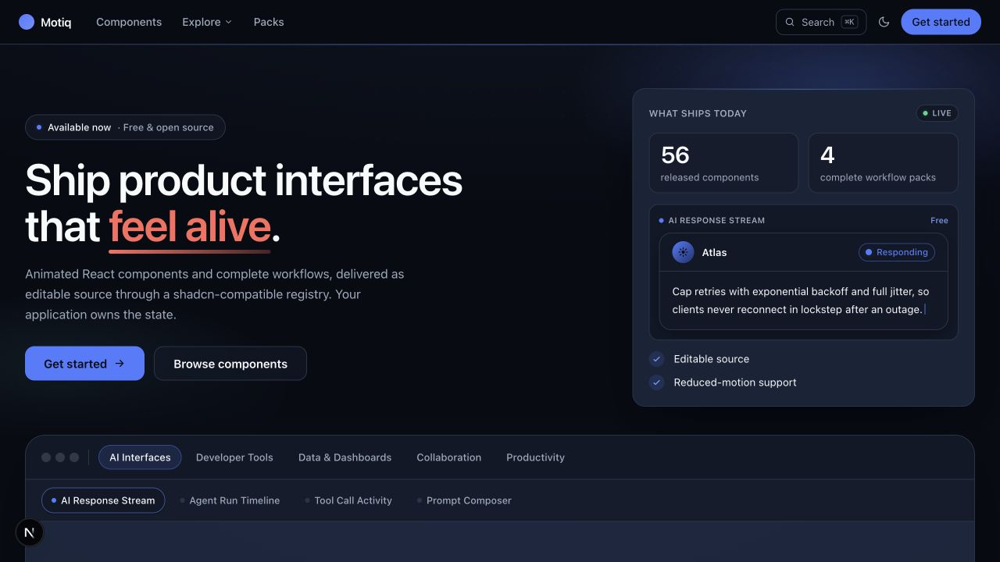

<div align="center">

# Motiq

### Animated React components for product interfaces that feel alive.

**60+ free, open-source components, workflow blocks, and packs.**<br />
Install the source with shadcn. Own the code. Ship it your way.

[](https://github.com/RMahammad/motiq/stargazers)
[](./LICENSE)
[](https://github.com/RMahammad/motiq/actions/workflows/ci.yml)

[Explore components](https://motiq.dev/components) ·
[Get started](https://motiq.dev/getting-started) ·
[Browse workflow packs](https://motiq.dev/packs) ·
[Contribute](./CONTRIBUTING.md)

</div>

<p align="center">
  <a href="https://motiq.dev">
    
  </a>
</p>

## Why Motiq?

Most animation libraries stop at the effect. Motiq focuses on the product
interface around it: real states, real interactions, and the details that make a
component safe to ship.

- **Built for product UI** — AI responses, deployment pipelines, live data,
  collaboration, security, commerce, files, and other application workflows.
- **Editable source** — shadcn installs the TypeScript and Tailwind source directly
  into your project. There is no black-box runtime package or vendor lock-in.
- **Accessible by default** — keyboard behavior, focus management, screen-reader
  semantics, and color-independent states are part of the component contract.
- **Reduced-motion safe** — every animation has a deliberate
  `prefers-reduced-motion` behavior; continuous effects pause when offscreen.
- **React Server Component safe** — client boundaries are explicit and tested for
  modern Next.js applications.
- **Designed as a system** — shared semantic tokens and motion primitives keep the
  catalog coherent when several components appear on the same screen.

> **AI interfaces** · **Developer tools** · **Collaboration** · **Data motion** ·
> **Commerce** · **Security** · **Productivity** · **Workflow environments**

## Install a component

Motiq uses a [shadcn-compatible registry](https://ui.shadcn.com/docs/registry). Register the
`@motiq` namespace once, then add any component with a single command — no account or package
subscription required:

```bash
npx shadcn@latest add @motiq/ai-response-stream
```

The command copies the component and its registry dependencies into your project.
Every component page has its exact copy-ready command.

<details>
<summary>One-time setup — register the <code>@motiq</code> namespace</summary>

Add this to your `components.json` once; every `@motiq/…` command then works in any project:

```json
{
  "registries": {
    "@motiq": "https://motiq.dev/r/{name}.json"
  }
}
```

</details>

**Requirements:** React 18.3+ or 19, Tailwind CSS v4, and a
[shadcn-initialized project](https://ui.shadcn.com/docs/installation).

[Read the installation guide →](https://motiq.dev/getting-started)

## Explore the catalog

Motiq includes **56 components**, **8 composed workflow blocks**, and **4
one-command packs** across 17 categories.

| Build | Start with |
| --- | --- |
| AI products | [AI Response Stream](https://motiq.dev/components/ai-response-stream), [Agent Run Timeline](https://motiq.dev/components/agent-run-timeline), [Tool Call Activity](https://motiq.dev/components/tool-call-activity) |
| Developer platforms | [Deployment Pipeline](https://motiq.dev/components/deployment-pipeline), [Live Log Stream](https://motiq.dev/components/live-log-stream), [API Request Inspector](https://motiq.dev/components/api-request-inspector) |
| Collaborative apps | [Live Presence Stack](https://motiq.dev/components/live-presence-stack), [Comment Thread](https://motiq.dev/components/comment-thread), [Approval Workflow](https://motiq.dev/components/approval-workflow) |
| Data products | [KPI Number Morph](https://motiq.dev/components/kpi-number-morph), [Streaming Data Rows](https://motiq.dev/components/streaming-data-rows), [Data Refresh State](https://motiq.dev/components/data-refresh-state) |
| Complete workflows | [AI Interface Pack](https://motiq.dev/packs/ai-interface), [Developer Tools Pack](https://motiq.dev/packs/developer-tools), [Collaboration Pack](https://motiq.dev/packs/collaboration), [Data Motion Pack](https://motiq.dev/packs/data-motion) |

[Browse every component with a live preview →](https://motiq.dev/components)

## Production readiness is the feature

A polished preview is only the beginning. Components are held to the same baseline:

| Guarantee | What it means |
| --- | --- |
| Accessibility | WCAG 2.2 AA target, keyboard operation, visible focus, and screen-reader semantics |
| Motion safety | Tested reduced-motion behavior and offscreen pause for continuous animation |
| App compatibility | Strict TypeScript, intentional `"use client"` boundaries, SSR and RSC checks |
| Source quality | Semantic tokens, bounded dependencies, cleanup for listeners and animation loops |
| Consumer confidence | Unit, interaction, accessibility, and clean-project fixture coverage |

The catalog favors a smaller, coherent collection of useful product interfaces over
an endless gallery of disconnected effects.

## Local development

Motiq is a pnpm monorepo and requires Node.js 22.13 or newer.

```bash
git clone https://github.com/RMahammad/motiq.git
cd motiq
pnpm install
pnpm build
pnpm --filter docs-site dev
```

Useful checks:

```bash
pnpm lint
pnpm typecheck
pnpm test
pnpm docs:check
```

The main workspace lives in:

```text
packages/
  tokens/      Semantic design and motion tokens
  motion/      Shared motion primitives
  react/       React components
  sections/    Composed sections and blocks
  registry/    shadcn registry source and generator
apps/
  docs/        Documentation, live previews, and registry host
  storybook/   Component stories
```

## Help Motiq grow

Motiq is independently built and maintained. If it saves you time:

- [Star the repository](https://github.com/RMahammad/motiq) so more React
  developers can find it.
- Share a component or workflow you shipped with Motiq.
- [Report a bug or suggest an improvement](https://github.com/RMahammad/motiq/issues/new/choose).
- Pick up a focused issue and read the [contribution guide](./CONTRIBUTING.md).

## Sponsors

The entire catalog is free and always will be. Motiq is built and maintained
independently — sponsorship funds the unglamorous work that keeps it shippable:
accessibility reviews, cross-browser testing, registry hosting, and documentation.

<div align="center">

[](https://github.com/RMahammad/motiq/issues/new?template=sponsorship.md)

**Founding sponsors are recognized here and on [motiq.dev](https://motiq.dev) — your logo could be the first.**

</div>

Tiers and benefits are agreed transparently before any payment, and Motiq never
publishes invented audience or reach numbers.

## Contributors

<a href="https://github.com/RMahammad/motiq/graphs/contributors">
  
</a>

## License

[MIT](./LICENSE) © Mahammad Rustamov. Use, modify, and ship Motiq in personal and
commercial projects.
