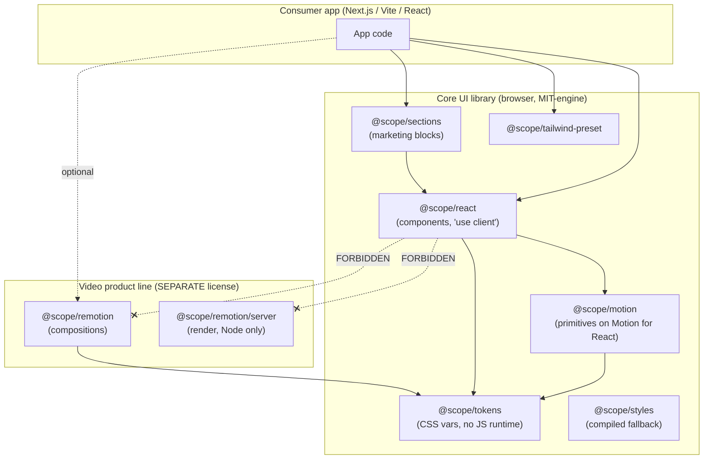
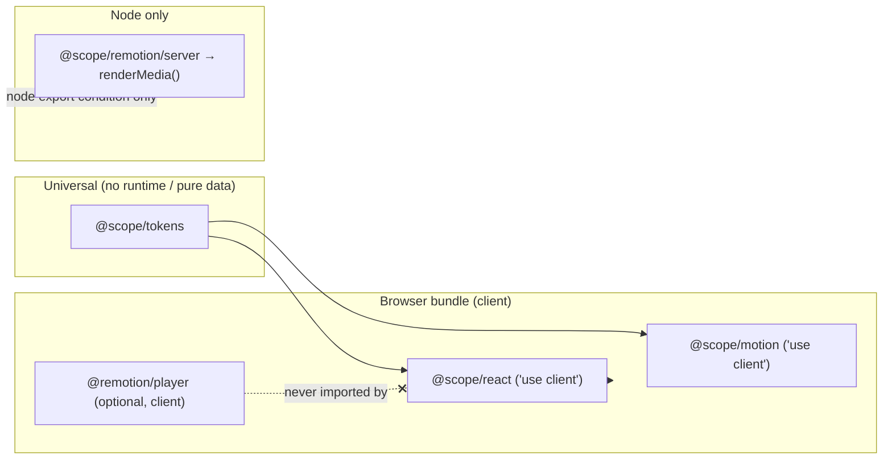
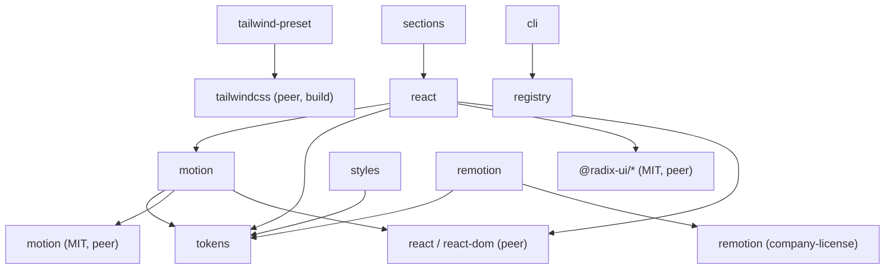

# 03 — Architecture

> **Type:** 🟢 Canonical for system architecture, boundaries, forbidden imports · **Implementation status:** 🟡 In progress — monorepo skeleton + `@scope/{tokens,motion,react}` + both fixtures exist (spike, 2026-07-14); MVP surface still Planned · **Last reviewed:** 2026-07-14
> **Owns:** browser/server split, package dependency rules, forbidden imports, architecture diagrams.
> **Do not** duplicate the per-package table ([`04-package-map.md`](04-package-map.md)) or the dependency evaluation ([`05-dependency-decisions.md`](05-dependency-decisions.md)) here.
> **Related ADRs:** [0001](adrs/0001-monorepo-tool.md) · [0002](adrs/0002-animation-engine.md) · [0003](adrs/0003-remotion-boundary.md) · [0007](adrs/0007-package-format.md)

## The load-bearing rules

1. **Engine isolation** — the core UI library uses only Motion for React + CSS/WAAPI. Remotion lives in its own packages and is never imported by core UI. See [`06`](06-animation-engine-decision.md), [`07`](07-remotion-strategy.md).
2. **Browser/server split** — server-only code (Remotion render, Node APIs) sits behind a `./server` subpath with the `node` export condition and is physically incapable of entering a browser bundle.
3. **No engine leakage upward** — `sections` compose `react`; they add no new animation engine.
4. **The core UI package (`@scope/react`) must not import Remotion, Node built-ins, or `next/*`.**

## System architecture



## Browser / server boundary



## Package dependency graph



Two hard firewalls: (1) nothing in the core column touches `remotion_ext`; (2) `sections` composes `react` but adds no new engine.

## Universal vs client-only packages

| Package | Runtime | `"use client"` | Notes |
|---|---|---|---|
| `tokens` | universal (pure data) | no | CSS vars + TS consts, no React runtime |
| `motion` | browser | **yes** | wraps Motion for React |
| `react` | browser | **yes** | components |
| `sections` | browser | **yes** | compose `react` |
| `tailwind-preset` | build-time | no | consumed by Tailwind |
| `styles` | build-time asset | no | compiled CSS fallback |
| `remotion` | browser + node | player=yes | **separate license** |
| `remotion/server` | **node only** | no | render pipeline |

Full per-package detail (deps, tier, CSS, allowed/forbidden imports): [`04-package-map.md`](04-package-map.md).

## Forbidden-import matrix

Enforced by ESLint `no-restricted-imports` (planned `@scope/eslint-config`) + a CI check + the boundary hook (see [`24`](24-claude-code-workflow.md#hooks)).

| From ↓ / May import → | tokens | motion | react | remotion | node builtins | next/* |
|---|---|---|---|---|---|---|
| `tokens` | — | ❌ | ❌ | ❌ | ❌ | ❌ |
| `motion` | ✅ | — | ❌ | ❌ | ❌ | ❌ |
| `react` | ✅ | ✅ | — | **❌** | **❌** | **❌** |
| `sections` | ✅ | ✅ | ✅ | ❌ | ❌ | ❌ |
| `remotion` | ✅ | ❌ | ❌ | — | server-subpath only | ❌ |

## Framework compatibility

Design targets: React 19 (and 18.3+ peer range), Next.js 16 App Router (primary) and Pages Router (where practical), Vite React, SSR, static rendering, React Strict Mode, Edge-runtime constraints where applicable. Every client component declares `"use client"`; the published bundle must **preserve** that directive — validated by fixture ([`14`](14-testing-strategy.md), [ADR-0006](adrs/0006-library-bundler.md)). Export-map / ESM conventions: [ADR-0007](adrs/0007-package-format.md).

## Monorepo layout (planned)

```
apps/       playground-next 🟡 · playground-vite 🟡 · storybook 🟡 · docs (Next.js) 🟡 · remotion-studio 🔵
packages/   tokens 🟡 · motion 🟡 · react 🟡 · sections 🔵 · tailwind-preset 🔵 · styles 🔵 · cli 🔵 ·
            registry 🔵 · remotion 🔵 · remotion-templates 🔵 · eslint-config 🔵 · tsconfig 🔵 · test-utils 🔵
root/       package.json · pnpm-workspace.yaml · turbo.json · tsconfig.base.json (all 🟢)
```

🟡 = spike scaffold exists (2026-07-14). Rationale for the layout (and packages pruned from the original example) is in [`04-package-map.md`](04-package-map.md). Monorepo tool choice: [ADR-0001](adrs/0001-monorepo-tool.md).
