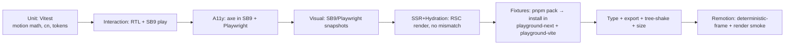

# 14 — Testing strategy

> **Type:** 🟢 Canonical for test layers & required CI checks · **Implementation status:** 🟡 In progress — Vitest+RTL for `Reveal`: **14 passing** (unit + SSR + reduced-motion + **axe a11y**, WCAG 2.2 AA scope). Import-boundary lint + `.github/workflows/ci.yml` gate exist. Visual, size-limit still Planned; the packed-tarball consumer fixture is 🟡 (see below) · **Last reviewed:** 2026-07-14
> **Owns:** the test pyramid, the fixture rule, the required CI checks.
> **Related:** [`13-performance-standard.md`](13-performance-standard.md) · [`12-accessibility-standard.md`](12-accessibility-standard.md) · [`18-release-process.md`](18-release-process.md) · [`testing-review` skill](../.claude/skills/testing-review/SKILL.md)
> Storybook 9 / Vitest facts verified 2026-07-14 — see [`05`](05-dependency-decisions.md#sources).

## Non-negotiable rule

**Fixtures install the packed tarball (`pnpm pack`), not monorepo source.** This is the only way to catch export-map, `"use client"`, and type-resolution failures before customers do.

## Test pyramid

## Required suites

| Suite | What it proves |
|---|---|
| Unit | motion calculations, easing, `cn`, token math |
| Interaction | RTL + Storybook `play()` — real user flows |
| Accessibility | axe = 0 violations (SB9 a11y + Playwright/axe) |
| Visual regression | appearance snapshots (labeled PRs) |
| Reduced-motion | final-state render under `prefers-reduced-motion` |
| SSR render + hydration | no mismatch; `"use client"` correctness |
| Next.js App Router fixture | component works in App Router (RSC + client boundary) |
| Vite fixture | component works in Vite React |
| Type tests | `expect-type`/`tsd` on public types |
| Export tests | `publint` + `@arethetypeswrong/cli` on the packed package |
| Tree-shaking | import one component → siblings absent from bundle |
| Bundle size | `size-limit` budgets ([`13`](13-performance-standard.md)) |
| Mobile browser | Playwright device emulation smoke |
| Remotion render smoke | a composition renders without error |
| Remotion deterministic-frame | same props → identical frame hash |

## Required CI checks

lint (+ import-boundary rules) · typecheck · unit/interaction · **a11y (axe)** · SSR/hydration · **fixture install of packed tarball** · export/type validation (`publint`/`attw`) · tree-shake · `size-limit` · visual (labeled PRs) · **changeset presence for public-API changes**.

A change is not mergeable until the checks relevant to it pass. Release adds the full gate — [`18-release-process.md`](18-release-process.md).

## Behavior coverage over line coverage

Reviews (via [`testing-review`](../.claude/skills/testing-review/SKILL.md)) identify **missing behavior** — states, reduced-motion path, SSR, keyboard — not just line percentages. A component with 100% lines but no reduced-motion test is **not** done ([`25`](25-definition-of-done.md)).

## Fixtures

Three consumer fixtures (🟡 implemented):
- `apps/playground-next` — Next.js 16 App Router (RSC boundary). Builds green.
- `apps/playground-vite` — Vite 6 client bundler. Builds green.
- `fixtures/tarball-consumer` — **installs the packed `pnpm pack` tarballs** (extracted into `node_modules/@scope/*`, **not** workspace source) and smoke-tests cross-package resolution, `"use client"` preservation, and SSR render. Registry-free (a full verdaccio publish/install is awkward in locked registries); run via `bash fixtures/tarball-consumer/verify.sh`, wired into CI's `fixtures` job. This is what makes `pnpm pack` output the actual release artifact under test.

Still planned for the fixture job: `publint`/`attw` export validation, tree-shaking assertion, and `size-limit` budgets.
