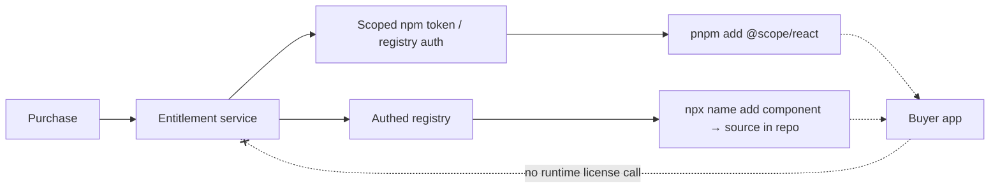

# 16 — Commercial packaging & distribution

> **Type:** 🟢 Canonical for the distribution & IP model · **Implementation status:** 🔵 Planned · **Last reviewed:** 2026-07-14
> **Owns:** delivery model, install-time gating, IP protection approach.
> **Related:** [`01-product-strategy.md`](01-product-strategy.md) · [`17-security-and-supply-chain.md`](17-security-and-supply-chain.md) · [`19-support-and-deprecation.md`](19-support-and-deprecation.md) · [ADR-0010](adrs/0010-commercial-distribution.md)
> ⚠️ Refund/terms interaction with source access needs **legal review** — see below and [`08`](08-remotion-license-analysis.md).

## Model: hybrid, install-time gating, no runtime secrets

| Model | DX | IP protection | Offline/CI | Revocation | Support | Verdict |
|---|---|---|---|---|---|---|
| Public npm | ★★★★★ | ✗ | ★★★★★ | ✗ | low | free tier only |
| Private npm (scoped org) | ★★★★ | ★★★ | ★★★★ (token) | ★★★★ | med | **compiled edition** ✅ |
| GitHub Packages | ★★★ | ★★★ | ★★★ | ★★★ | med | alt |
| Private repo access | ★★ | ★★★ | ★★★ | ★★★★ | high | no |
| Downloadable zip | ★★ | ★ (leaks) | ★★★★★ | ✗ | low | offline add-on only |
| Copy-paste | ★★★★ | ✗ | ★★★★★ | ✗ | high | free snippets |
| **shadcn-style registry + CLI** | ★★★★★ | ★★ | ★★★★ | ★★★ (auth registry) | med | **source edition** ✅ |
| Hosted API + runtime license check | ★ | ★★★ | ✗ | ★★★★★ | high | **rejected — intrusive, secrets risk** |

## Recommendation

- **Compiled edition** — private npm org scope; access via **per-customer granular npm token / registry auth** driven by billing entitlement. **No secrets in the frontend bundle, ever.** Revocation = revoke token.
- **Source edition** — **authenticated shadcn-style registry** (`@scope/registry` + `@scope/cli`): buyers `npx <name> add reveal` and own the code. Best DX and best differentiation; accepts leak risk (price it in; watermark generated files with the buyer's license id **as a comment for provenance, not enforcement**).
- **No runtime license checks** — they leak secrets, harm DX, break offline/CI. Gate at **purchase/install only**. This is a hard rule (also in [`/CLAUDE.md`](../CLAUDE.md)).

## Distribution flow

## Commercial tradeoffs

| | Compiled edition | Source/registry edition |
|---|---|---|
| Updates | easy (`pnpm up`) | buyer owns code → provide **codemods/migration notes** ([`migration-authoring`](../.claude/skills/migration-authoring/SKILL.md)) |
| Customization | limited | ultimate |
| IP | better | leak risk (accepted) |
| Buyer type | most buyers | power users |

Offer both. Most take compiled; power users take registry.

## Supply-chain hooks (see [`17`](17-security-and-supply-chain.md))

npm **provenance** (`--provenance`), 2FA on publish, minimal CI publish scope, committed lockfile, Renovate/Dependabot, `publint`. No customer data collection; telemetry off by default and opt-in only.

## Legal review flags

- **Refunds + source access conflict** — the buyer can keep the source. Mitigate with a short refund window, seat-based licensing, and clear terms. **Have counsel draft this.**
- Redistribution restrictions, agency/client terms, enterprise terms — [`01`](01-product-strategy.md#commercial-terms-draft--lawyer-review-required).
- Remotion resale interaction — [`08`](08-remotion-license-analysis.md).
