# 18 — Release process

> **Type:** 🟢 Canonical for the release pipeline & checklist · **Implementation status:** 🔵 Planned (no CI yet) · **Last reviewed:** 2026-07-14
> **Owns:** the release pipeline, versioning policy, release checklist.
> **Related:** [`14-testing-strategy.md`](14-testing-strategy.md) · [`19-support-and-deprecation.md`](19-support-and-deprecation.md) · [`17-security-and-supply-chain.md`](17-security-and-supply-chain.md) · [`release-readiness` skill](../.claude/skills/release-readiness/SKILL.md)

## Pipeline

```mermaid
graph LR
  PR[PR] --> ci{CI}
  ci --> lint[lint+boundaries] --> tc[typecheck] --> t[unit/interaction] --> a11y[axe]
  a11y --> ssr[SSR/hydration] --> build[build: preserve use client]
  build --> pack[pnpm pack] --> fix[install tarball in next+vite fixtures]
  fix --> exp[publint + attw + tree-shake + size-limit]
  exp --> merge[merge → changeset version PR]
  merge --> rel[release: npm publish --provenance] --> gh[GitHub release + docs deploy]
```

## Versioning policy

- **Semver.** Breaking public-API change → **major** + migration guide + codemod where feasible ([`migration-authoring`](../.claude/skills/migration-authoring/SKILL.md)).
- **Changesets** drive versioning and changelog; a changeset is **required** for any public-API change (CI-checked, [`14`](14-testing-strategy.md)).
- Peer-dependency range bumps are documented in the changelog.
- Security releases are fast-tracked on supported majors ([`19`](19-support-and-deprecation.md)).
- Channels: `@next` (canary) → beta → stable.

## Release checklist

Driven by [`release-readiness`](../.claude/skills/release-readiness/SKILL.md) and [`templates/release-checklist.md`](templates/release-checklist.md):

- [ ] All CI green (lint/boundaries, typecheck, unit/interaction, a11y, SSR/hydration).
- [ ] Changeset consumed; CHANGELOG generated.
- [ ] Build **preserves `"use client"`** in published entry points.
- [ ] `pnpm pack` inspected (`--dry-run` file list; no source maps leaking secrets; `"use client"` present).
- [ ] Fixtures (`playground-next`, `playground-vite`) install the tarball and pass.
- [ ] `publint` + `@arethetypeswrong/cli` clean.
- [ ] `size-limit` budgets met ([`13`](13-performance-standard.md)).
- [ ] Docs deployed; internal link check passes.
- [ ] Migration guide present for any breaking change.
- [ ] `npm publish --provenance`; 2FA; least-privilege token ([`17`](17-security-and-supply-chain.md)).
- [ ] Git tag + GitHub release notes.
- [ ] Go/no-go report produced.

## Rollback

Deprecate the bad version (`npm deprecate`) and republish the prior known-good; never unpublish a widely-installed version. Communicate to customers ([`19`](19-support-and-deprecation.md)).

## Release verification

Post-publish: install the published package from a clean environment into a fixture and run the smoke + type + tree-shake checks (the fixture rule from [`14`](14-testing-strategy.md) applies to the published artifact too, not just the tarball).
