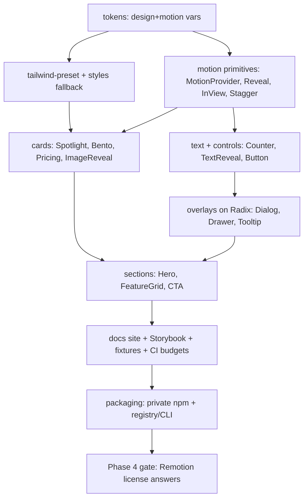

# 20 — MVP roadmap

> **Type:** 🟢 Canonical for MVP scope, implementation order, and phases · **Implementation status:** 🔵 Planned (Phase 0) · **Last reviewed:** 2026-07-14
> **Owns:** exact MVP list, free/premium split, hero components, build order, phase gates, exclusions.
> **Related:** [`21-component-inventory.md`](21-component-inventory.md) (full matrix) · [`00-executive-summary.md`](00-executive-summary.md) · [`23-open-questions.md`](23-open-questions.md)

## Exact MVP scope (24 components on a ~10-primitive layer)

A coherent landing-page + SaaS starter kit, **not** 24 novelties.

**Primitives/foundation (used everywhere):** 1) MotionProvider 2) Reveal 3) Fade/Slide/Scale (one component, `direction` prop) 4) Stagger + StaggerItem 5) InView 6) ScrollProgress.
**Text:** 7) AnimatedNumber/Counter 8) TextReveal (word/char) 9) GradientText 10) RotatingWords.
**Controls:** 11) AnimatedButton 12) LoadingButton.
**Cards:** 13) SpotlightCard 14) BentoGridItem 15) PricingCard 16) ImageReveal 17) BlurReveal.
**Overlays (Radix):** 18) Dialog 19) Drawer/Sheet 20) Tooltip/Popover.
**Feedback:** 21) Skeleton.
**Media:** 22) Marquee.
**Sections (compose the above):** 23) HeroSection 24) FeatureGrid + CTASection (shipped as a "sections starter").

**Why each is in:** reusable across landing *and* SaaS, powered by ≤3 primitives, accessible, within perf budget, demo-able. Excluded from MVP: parallax, particles, command palette, horizontal scroll, tilt (all V1+ due to a11y/perf/support risk — [`21`](21-component-inventory.md)).

## Free vs premium split

- **Free (funnel):** MotionProvider, Reveal, Fade/Slide/Scale, Stagger, InView, ScrollProgress, GradientText, Skeleton.
- **Premium:** everything else + all sections.

## Five hero components (marketing screenshots/video)

**HeroSection**, **PricingCard**, **BentoGridItem**, **TextReveal**, **SpotlightCard**.

## Implementation order

## Definition of done (MVP components)

See [`25-definition-of-done.md`](25-definition-of-done.md). Per component: typed 3-level API · `forwardRef` · correct `"use client"` · reduced-motion fallback · Radix where applicable · SB story + interaction test · axe 0 violations · SSR/hydration test · size within budget · docs page with real example · export map updated · changeset.

## Release blockers

Any axe violation · hydration mismatch · missing reduced-motion path · size regression · `"use client"` stripped in published output · fixture install failure. ([`14`](14-testing-strategy.md), [`18`](18-release-process.md).)

## Phased roadmap

Relative size + dependency order, **no calendar estimates** (insufficient info).

| Phase | Goals | Key deliverables | Depends on | Exit criteria | Do NOT build yet |
|---|---|---|---|---|---|
| **0 Validation** | de-risk market/license/arch | buyer interviews, arch spike (Next+Vite fixtures render a Motion component with `"use client"` intact), Remotion license questions sent, 2 prototypes, perf spike | — | fixtures prove RSC-safe build; buyers confirm pain | any real components |
| **1 Foundation** | repo + rails | monorepo, CI (all gates), tokens, MotionProvider, primitive layer, Storybook, docs shell, size budgets, packaging skeleton | 0 | primitives shipped+tested; CI green; tarball installs in fixtures | marketing sections |
| **2 MVP** | sellable v1 | ~24 components, 5 hero components, full docs, starter template, private npm + registry/CLI, beta customers | 1 | DoD met for all 24; beta buyers using it | Remotion, novelty FX |
| **3 Stable 1.0** | trust | frozen public API, migration guarantees, final license+terms (lawyer-reviewed), release automation, support workflow, enforced budgets | 2 | 1.0 published w/ provenance; support SLA defined | new engines |
| **4 Remotion pack** | video line | shared Remotion primitives, compositions, Zod schema, Player/render examples, separate license/docs | 3 + **[`08`](08-remotion-license-analysis.md) answers in writing** | license gate cleared; templates deterministic+tested | hosted render at scale (unless validated) |
| **5 Expansion** | grow | more packs, advanced scroll (mobile fallbacks), React Aria widgets, Figma kit, CLI/registry polish, enterprise | 4 | new packs meet same DoD | features without buyer demand |
