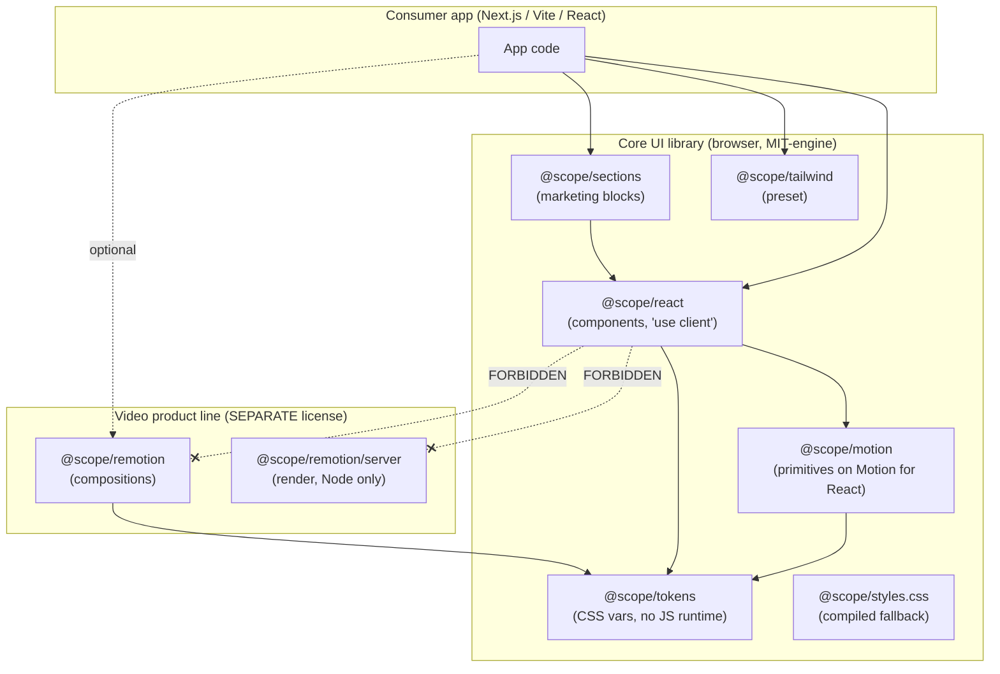
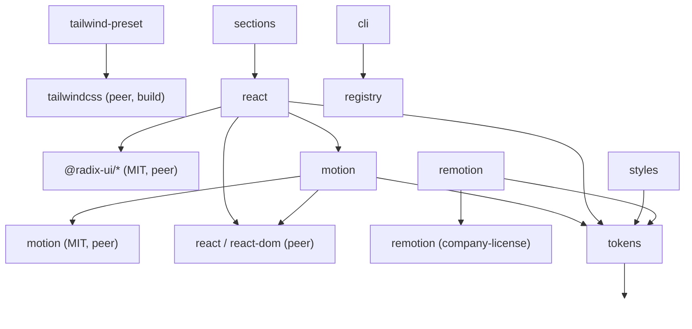
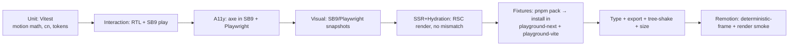
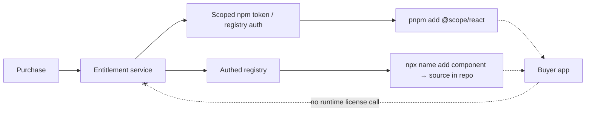
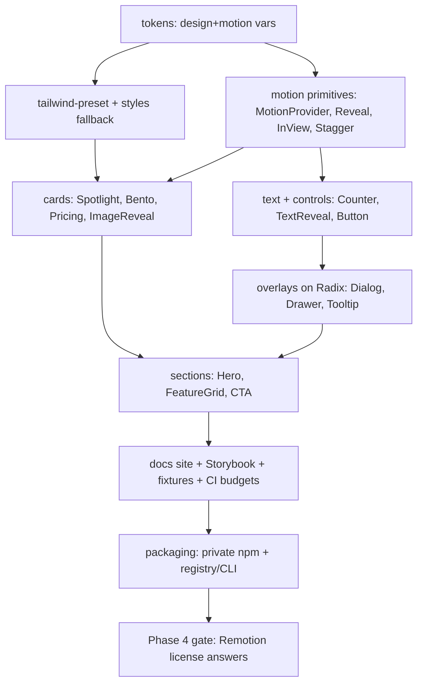

> Archived source document. The maintained documentation now lives in [`docs/README.md`](../README.md).
> Do not update this file directly. It is retained only for provenance and for the section-mapping in [`section-mapping.md`](./section-mapping.md).
> Archived: 2026-07-14.

---

# Production-Ready, Commercially Sellable Animated Component Library — Architecture, Product & Delivery Plan

> **Verification status legend:** **[FACT]** = verified against primary/current sources (cited at the end), **[REC]** = architectural judgment/recommendation, **[ASSUMPTION]** = stated assumption, **[LEGAL-UNCERTAIN]** = ambiguous legal terms requiring professional review.
> **Sources verified:** 2026-07-14.
> ⚠️ Nothing in this document is legal advice. All license text and commercial terms must be reviewed by a qualified attorney before sale.

A note up front: the starting hypothesis (Motion for React + CSS/WAAPI for interactive UI; Remotion for video only; GSAP as optional adapter) is essentially correct and is endorsed below with modifications. The most important point: **the biggest risks in this project are not technical — they are (a) Remotion's commercial license boundary, (b) shipping too many novelty components, and (c) the `"use client"` + RSC packaging pitfall.** The architecture is built to contain all three.

---

## Table of contents

1. [Executive recommendation](#1-executive-recommendation)
2. [Key assumptions](#2-key-assumptions)
3. [Unresolved questions](#3-unresolved-questions-must-answer-before-phase-2)
4. [Product positioning](#4-product-positioning)
5. [Competitive analysis](#5-competitive-analysis)
6. [Architecture decision](#6-architecture-decision)
7. [Animation-engine comparison matrix](#7-animation-engine-comparison-matrix)
8. [Remotion role and licensing analysis](#8-remotion-role-and-licensing-analysis)
9. [Monorepo architecture](#9-monorepo-architecture)
10. [Package dependency graph](#10-package-dependency-graph)
11. [Recommended dependency table](#11-recommended-dependency-table)
12. [Public API design standard](#12-public-api-design-standard)
13. [Tailwind & theming strategy](#13-tailwind--theming-strategy)
14. [Accessibility standard](#14-accessibility-standard)
15. [Performance budgets](#15-performance-budgets)
16. [Testing strategy](#16-testing-strategy)
17. [Documentation strategy](#17-documentation-strategy)
18. [Commercial packaging & distribution](#18-commercial-packaging--distribution)
19. [Prioritized component inventory](#19-prioritized-component-inventory)
20. [Exact MVP component list (24)](#20-exact-mvp-component-list-24)
21. [Implementation order](#21-implementation-order)
22. [Claude Code consistency system](#22-claude-code-consistency-system)
23. [Proposed CLAUDE.md (root)](#23-proposed-claudemd-root)
24. [Proposed Claude Code skills](#24-proposed-claude-code-skills)
25. [Proposed subagents](#25-proposed-subagents)
26. [Proposed hooks](#26-proposed-hooks)
27. [Reference component implementations](#27-reference-component-implementations)
28. [CI & release strategy](#28-ci--release-strategy)
29. [Risk register](#29-risk-register)
30. [Phased roadmap](#30-phased-roadmap)
31. [ADR list + initial ADR contents](#31-adr-list--initial-adr-contents)
32. [Immediate next 10 actions](#32-immediate-next-10-actions)
- [Sources](#sources-verified-2026-07-14)

---

## 1. Executive recommendation

Build a **pnpm + Turborepo monorepo** shipping an **ESM-only, tree-shakeable React component library** whose default animation engine is **Motion for React (MIT)** layered over **CSS/Web Animations API**, with **Remotion quarantined into a separate, separately-licensed paid product line** that the core UI library never imports.

Decisions, condensed:

| Question | Decision | Confidence |
|---|---|---|
| Primary animation engine | **Motion for React** (MIT) + CSS/WAAPI for cheap effects | High |
| Remotion's role | **Option 2 + 3**: video/timeline compositions and previews/export only — *never* the browser-UI engine | High |
| GSAP | Optional **separate adapter package**, not a core dep | High |
| Monorepo | pnpm workspaces + **Turborepo** | High |
| Bundler | **tsdown** (Rolldown) as default; **tsup** as fallback — gated on a `"use client"` preservation fixture test | Medium-High |
| Styling | **Hybrid**: Tailwind preset + CSS variables + shipped compiled CSS fallback; `cn()` = `clsx`+`tailwind-merge`; variants via **CVA** | High |
| Accessible primitives | **Radix Primitives** default; **React Aria** for date/complex widgets later | High |
| Packaging | **Hybrid**: compiled private npm package (`@scope`, entitlement-gated) **+** shadcn-style **source registry** for deep customization | High |
| Distribution IP model | **No runtime license checks.** Gate at *install/purchase* (private registry token + registry auth), not at runtime | High |
| Docs | **Storybook 9** (dev/test) + a **Next.js docs site** (marketing/catalog) | High |
| MVP | **~24 components** on a **~10-primitive** layer; 5 hero components | High |
| Product shape | **One-time purchase per major version + optional yearly updates**, individual & team seats, agency tier | Medium (business call) |

**The single most important architectural invariant:** `@scope/react` (the interactive UI package) must have **zero dependency on Remotion, Node APIs, or Next.js**. Remotion lives only in `@scope/remotion*`. This is enforced by ESLint import boundaries + a CI check + a hook, not by discipline alone.

---

## 2. Key assumptions

1. **[ASSUMPTION]** You are a small team (1–4 people). This directly affects Remotion licensing (you may be in the free tier for *your own* use) and argues against heavy infra (self-hosted render farms) at launch.
2. **[ASSUMPTION]** Target buyers are **React/Next.js product engineers and indie founders/agencies** building SaaS landing pages and dashboards — not designers-who-can't-code and not video editors.
3. **[ASSUMPTION]** You want to ship in months, not build a 300-component behemoth. Optimizing for a coherent, maintainable ~24-component v1.
4. **[ASSUMPTION]** Tailwind is the primary styling target but **not-Tailwind users must not be locked out** (hence the compiled-CSS fallback).
5. **[ASSUMPTION]** "Sellable" means a real product with docs, tests, licensing, and support — stated explicitly.
6. **[ASSUMPTION]** You are comfortable with ESM-only (Next 16, React 19, Vite all support it natively).
7. **[LEGAL-UNCERTAIN]** Remotion template resale terms need direct confirmation — see §8.

---

## 3. Unresolved questions (must answer before Phase 2)

**Blocking:**
1. **[LEGAL-UNCERTAIN]** Does selling *original templates built with Remotion* to customers who will render them require **each customer** to hold a Remotion company license if their company is 4+ people? Who bears that obligation — you or the buyer? (Send to Remotion + counsel — question list in §8.)
2. Does the Remotion product embed **`@remotion/player`** in the buyer's app (adds a client-side dep + license surface) or only ship source templates + a render service?
3. Business model: **one-time vs subscription** — recommendation is one-time+updates, but this is your call (see §18).

**Important:**
4. Do you want a **free tier** at all? (Recommended: a small free "primitives" set for funnel — see §4.)
5. Will you offer **hosted rendering** for Remotion videos (real infra cost + support burden) or source-only?
6. Team size trajectory (affects your *own* Remotion license obligation).
7. Brand/product name (criteria in §4; not invented here).

---

## 4. Product positioning

**[REC]**

- **Target audience:** React/Next.js engineers at seed–Series B SaaS companies, plus indie hackers and small agencies, who need a landing page or dashboard to look premium *without* an in-house motion designer.
- **Core problem solved:** "Animated component collections look amazing in demos but are painful to use in production — inaccessible, not typed, not themeable, break in the App Router, and are unmaintained." You sell **production-grade, accessible, RSC-safe motion** — the boring-but-hard 80% that copy-paste kits skip.
- **Unique value proposition:** *"Premium motion you can actually ship: accessible by default, reduced-motion aware, Server-Component-safe, typed, themeable, and tested — with a source-registry escape hatch when you need to customize."*
- **Positioning against the market (see §5):** Not "more components than X." Instead: **"the one animated kit that passes an accessibility audit and doesn't break your Lighthouse score."**

**Product name criteria** (don't reuse competitor identity): short, pronounceable, motion-adjacent but not literally "Motion/Framer/GSAP", available `.com` + npm scope + GitHub org, trademark-clear, works as a CLI verb (`npx <name> add reveal`). Brand direction: **restrained, technical, "engineered motion"** — dark editorial docs, precise not flashy (differentiates from the loud gradient-heavy competitors).

**Commercial terms** (business calls — *review with a lawyer*, see §18):

| Term | Recommendation |
|---|---|
| Free vs paid | Small **free** primitive/core tier (funnel) + **paid** components/sections/Remotion |
| Individual vs team | Per-seat; team license (≤N devs); agency license (unlimited client projects) |
| Source vs compiled | **Both** — compiled npm for convenience, registry source for customization |
| One-time vs subscription | **One-time per major version + optional annual "updates & new components" renewal** |
| Commercial use | Permitted in unlimited end products; **redistribution of the library itself prohibited** |
| Agency/client work | Allowed under agency tier; deliver to clients as *compiled output in the client's app*, not the source package |
| Enterprise | Custom: SSO, priority support, private Slack, invoice billing |
| Refunds | 14-day, with anti-abuse (source access complicates this — see §18) |

> ⚠️ **All license text and commercial terms must be reviewed by a qualified attorney before sale.** Nothing here is legal advice.

---

## 5. Competitive analysis

**[FACT — market categories]** / **[REC — interpretation]**. No competitor's code, copy, or visual identity was copied.

| Category | Representative model | Buyer | Typical pricing | Common weakness (your opening) |
|---|---|---|---|---|
| shadcn-style OSS + paid blocks | Free primitives, paid templates/blocks | Product engineers | $0 core / $99–$499 blocks | Accessibility & motion depth vary; differentiate on *motion quality + a11y* |
| Animated "magic" component kits | Copy-paste, MIT-ish, flashy | Landing-page builders | Free or cheap | **Unmaintained, inaccessible, App-Router breakage, no reduced-motion** — your core wedge |
| Premium Tailwind UI kits | Compiled + HTML/React snippets | Teams | $149–$799 one-time | Little/no motion; static |
| SaaS UI/dashboard kits | Figma + code | Founders | $99–$299 | Motion is decorative, not systematic |
| Motion preset products | Presets/hooks | Devs | Small | Not a full system |
| Remotion template marketplaces | Video templates | Marketers/devs | Per-template | Fragmented; licensing confusion |

**Structural insights [REC]:**
- **Visually impressive but production-hostile:** particle fields, heavy WebGL/blur backgrounds, infinite parallax, cursor-follow physics, scroll-scrubbed video. These generate screenshots but cause jank, motion sickness, and mobile battery drain → make them **opt-in, lazy-loaded, reduced-motion-gated**, and *market them honestly*.
- **Frequently copied, rarely maintained properly:** command palette, mega menu, carousel, toast, dialog/drawer, marquee. These are **accessibility minefields** → build them on Radix and make a11y your headline feature.
- **Support-problem generators:** anything with scroll pinning, `position: sticky` interactions, z-index/overlay stacking, and Tailwind class-detection failures. Design these out (§9, §12).
- **Justifies premium price:** guaranteed accessibility + reduced motion, RSC/App-Router safety, TypeScript-first API, theming via tokens, tested + versioned + migration guides, source-registry access, real docs. **These are exactly the things copy-paste kits don't do.**

**Positioning conclusion:** win on **trust and production-readiness**, not component count.

---

## 6. Architecture decision

**[REC]** Layered, boundary-enforced monorepo. The load-bearing rule is the **browser/server split** and **engine isolation**.



Key properties:
- `@scope/react` depends only on `@scope/motion`, `@scope/tokens`, and peer `react`/`react-dom` — **not** Remotion, **not** Node, **not** Next.
- Remotion may reuse `@scope/tokens` (pure CSS vars/JS constants) so videos and UI share a design language, but the dependency arrow **never** points back into the UI package.
- Server-only Remotion render code lives behind a `./server` subpath with the `node` export condition and is physically incapable of entering a browser bundle.

---

## 7. Animation-engine comparison matrix

**[FACT]** columns cite sources at the end; **[REC]** scoring is judgment on a 1–5 scale (5 = best for a paid, accessible React/Next library).

| Criterion | Motion for React | CSS anim/trans | WAAPI | GSAP | React Spring | Remotion | Custom rAF/spring | View Transitions API |
|---|---|---|---|---|---|---|---|---|
| Runtime bundle | 3 (~34kb full; ~4.6kb via `m`+LazyMotion) [FACT] | 5 (0) | 5 (~0) | 3 (~23kb core+) | 4 | 1 (huge; not for browser UI) | 5 | 5 (native) |
| Tree-shaking | 4 (`m`/LazyMotion) | 5 | 5 | 3 | 4 | 1 | 5 | 5 |
| React integration | 5 | 3 | 3 | 3 (needs wrappers) | 5 | 5 (its own tree) | 3 | 3 |
| Next App Router / RSC | 4 (client-only; needs `"use client"`) | 5 | 4 | 3 | 4 | 2 (client player only) | 4 | 4 |
| SSR/hydration | 4 | 5 | 4 | 3 | 4 | 2 | 4 | 4 |
| Reduced-motion a11y | 5 (`useReducedMotion`, `MotionConfig`) | 4 (media query) | 3 | 2 (manual) | 3 | 2 | 2 | 3 |
| Layout animation | 5 (`layout`/shared) | 1 | 1 | 3 | 2 | n/a | 1 | 4 (morph) |
| Gestures | 5 | 2 | 1 | 3 | 3 | n/a | 2 | 1 |
| Scroll-linked | 5 (`useScroll`) | 3 (scroll-timeline) | 3 | 5 (ScrollTrigger) | 3 | n/a | 3 | 2 |
| Timeline sequencing | 3 | 2 | 3 | 5 | 2 | 5 (frame-exact) | 2 | 1 |
| Deterministic frames | 1 | 1 | 1 | 2 | 1 | 5 | 1 | 1 |
| Video export | 1 | 1 | 1 | 1 | 1 | 5 | 1 | 1 |
| License (paid redistribution) | 5 (MIT) [FACT] | 5 | 5 | 4 (free, anti-compete clause) [FACT] | 5 (MIT) | 2 (company license; resale ambiguous) [LEGAL-UNCERTAIN] | 5 | 5 |
| Learning curve | 4 | 5 | 3 | 3 | 3 | 2 | 2 | 4 |
| Long-term maintenance | 4 | 5 | 4 | 4 | 3 | 3 | 2 | 4 |
| Low-powered devices | 4 | 5 | 4 | 4 | 3 | 1 | 3 | 4 |
| Browser support | 4 | 5 | 4 | 5 | 4 | n/a | 4 | 2 (still uneven) |
| Fit for paid lib | **5** | 5 | 4 | 4 | 3 | 2 (video only) | 2 | 3 |

**Decision [REC]:**
- **Default engine: Motion for React**, used through the `m` component + `LazyMotion` to keep bundle small, and always wrapped in your own primitives so buyers never touch Motion internals directly (§11).
- **Cheap effects (fades, hovers, simple reveals): plain CSS/transitions** — zero runtime, best on low-end devices. Your `Reveal` uses CSS + IntersectionObserver where physics aren't needed; escalates to Motion only for spring/layout/gesture.
- **WAAPI:** used internally by some primitives (e.g. one-shot imperative animations) but not a public surface.
- **GSAP:** **optional `@scope/gsap-adapter`** package for the rare complex timeline (only after confirming the anti-compete clause doesn't bite — it doesn't for a component library, but you are *not* building a no-code animation builder, so document that).
- **View Transitions API:** progressive enhancement for `PageTransition`/route morphs, with a Motion fallback (support still uneven).
- **Remotion:** video only (§8).

**Your hypothesis is endorsed** with the refinement that CSS should carry more of the load than a naive "Motion for everything" approach — this is what protects your performance budget.

---

## 8. Remotion role and licensing analysis

**Role [REC]:** Remotion is **Option 2 + 3** — frame-based video compositions/templates + previews/export. It is a **separate product line and separate package** (`@scope/remotion`, `@scope/remotion/server`). The core UI library must not depend on it (§6). Rationale: Remotion renders its own React tree for deterministic frame output; it is the wrong tool for interactive DOM UI and would poison your bundle and license story.

**Licensing facts [FACT]:**
- Remotion is **free** for individuals, non-profits, and for-profit organizations of **up to 3 people**, including commercial use and self-hosted rendering.
- A **paid company license** is required once a for-profit org has **4+ people**; pricing ~**$25/developer/month**, minimum **$100/month or $1000/year**. Existing subscribers are grandfathered.
- `@remotion/licensing` exists for programmatic license/usage tracking (relevant if you build hosted rendering).

**What matters is which of these your product does [REC framing]:**

| Your product action | License exposure |
|---|---|
| Sell **original templates** (source you wrote) | Lowest risk — you're selling your code, not Remotion. But buyers who render need their *own* license if 4+ people. [LEGAL-UNCERTAIN] |
| Embed **`@remotion/player`** in buyer apps | Player in the browser; confirm redistribution + buyer license obligations |
| **Render videos for customers** (hosted) | You are operating Remotion at scale → you almost certainly need a company license and possibly usage terms |
| Let users **edit template values** (props) | Generally fine (that's the point of templates) |
| Let users **edit Remotion code** | Closer to "distributing a Remotion dev environment" — clarify |
| Let users **upload arbitrary Remotion projects** | Highest ambiguity — looks like offering Remotion-as-a-service |
| Anything that reads as **selling Remotion itself** or enabling **license circumvention** | Prohibited — avoid entirely |

**[LEGAL-UNCERTAIN] — do not treat any of the following as settled.** Questions to send to **Remotion (hello@remotion.dev / their licensing contact) and your attorney**:

1. If we sell original video *templates* built with Remotion, does the **end buyer** need their own company license to render them (when 4+ employees), or does our license cover their rendering?
2. May we **redistribute** `@remotion/player` inside a paid component/template package? Any attribution or license-passthrough requirements?
3. If we offer **hosted rendering** for customers, what license tier/usage terms apply, and does `@remotion/licensing` satisfy compliance?
4. Are there restrictions on letting customers **edit template code** vs only props?
5. Does bundling Remotion templates in a **paid marketplace** trigger any redistribution clause distinct from normal app use?
6. Confirmation that our **own team size** determines our development-time license obligation, independent of what we sell.

**Do not ship the Remotion product line until 1–5 are answered in writing.** This is a Phase-4 gate, which is why Remotion is deliberately *last* in the roadmap.

```mermaid
graph LR
  subgraph Studio["Dev: Remotion Studio"]
    comp[Composition + Zod schema]
  end
  subgraph AppSide["Buyer app (browser)"]
    player["@remotion/player<br/>(client, optional)"]
  end
  subgraph Server["Render (Node/Lambda, licensed)"]
    render["@scope/remotion/server<br/>renderMedia()"]
  end
  comp -->|preview| Studio
  comp -->|validated props| player
  comp -->|validated props| render
  render --> mp4[(MP4/WebM)]
  player -. never in .-x CoreUI[@scope/react]
```

---

## 9. Monorepo architecture

**[REC]** pnpm workspaces + Turborepo. Keep only packages that earn their place — the example list has been pruned.

```
repo/
├─ apps/
│  ├─ docs/               # Next.js docs+marketing site (public)
│  ├─ storybook/          # SB9 dev/test workbench (private)
│  ├─ playground-next/    # App Router fixture (private, test target)
│  ├─ playground-vite/    # Vite fixture (private, test target)
│  └─ remotion-studio/    # Remotion Studio host (private, Phase 4)
├─ packages/
│  ├─ tokens/             # design + motion tokens → CSS vars + TS consts
│  ├─ motion/             # motion primitives (Reveal, Stagger, …) on Motion
│  ├─ react/              # interactive components ("use client")
│  ├─ sections/           # marketing sections (compose react)
│  ├─ tailwind-preset/    # Tailwind v4 preset (@theme + plugin)
│  ├─ styles/             # compiled CSS fallback (non-Tailwind users)
│  ├─ cli/                # `npx <name> add <component>` (registry installer)
│  ├─ registry/           # shadcn-style JSON registry of source components
│  ├─ remotion/           # video compositions (Phase 4, separate license)
│  ├─ remotion-templates/ # editable template packs (Phase 4)
│  ├─ eslint-config/      # shared + import-boundary rules (private)
│  ├─ tsconfig/           # shared TS bases (private)
│  └─ test-utils/         # render/a11y/reduced-motion helpers (private)
└─ tooling/
   ├─ size-limit config, changeset config, turbo.json, pnpm-workspace.yaml
```

**Pruned from your example (with reasons):** `core/` (folded into `tokens`+`motion` — a separate empty "core" invites a dumping ground), `primitives/` (merged into `motion/` — one primitive layer, not two), `presets/` (motion presets live in `tokens`/`motion`), `icons/` (recommend peer-dep on an existing icon set like `lucide-react` rather than shipping your own icon package — dependency review in §24), `internal-admin/` (a hosted app, not a library concern — build only if you run hosted rendering), `internal-license/` (**deliberately omitted — no runtime license package; gate at install, §5/§18**), `remotion-templates` kept but Phase 4.

**Per-package spec:**

| Package | Public? | Env | `"use client"`? | Tree-shake | Ships CSS? | Tier | Needs Tailwind? | Needs Remotion? | Peer deps |
|---|---|---|---|---|---|---|---|---|---|
| `tokens` | ✅ | universal | no | ✅ | yes (vars) | free | no | no | — |
| `motion` | ✅ | browser | **yes** | ✅ | no | free | no | no | react, react-dom, motion |
| `react` | ✅ | browser | **yes** | ✅ | optional | paid | no (fallback) | no | react, react-dom, motion, radix |
| `sections` | ✅ | browser | **yes** | ✅ | optional | paid | no (fallback) | no | react, react-dom |
| `tailwind-preset` | ✅ | build-time | no | n/a | preset | free | Tailwind | no | tailwindcss |
| `styles` | ✅ | build-time | no | n/a | **yes** | free | no | no | — |
| `cli` | ✅ | node | no | n/a | no | free | no | no | — |
| `registry` | ✅(gated) | data | n/a | n/a | source | paid | no | no | — |
| `remotion` | ✅(gated) | browser+node | player=yes | ✅ | no | **paid, separate** | no | **yes** | react, remotion |
| `remotion/server` | ✅(gated) | **node only** | no | n/a | no | paid | no | yes | @remotion/renderer |
| `eslint-config`,`tsconfig`,`test-utils` | ❌ | dev | no | n/a | no | — | — | — | — |

**Forbidden-import matrix (enforced by ESLint `no-restricted-imports` + CI):**

| From ↓ / May import → | tokens | motion | react | remotion | node builtins | next/* |
|---|---|---|---|---|---|---|
| `tokens` | — | ❌ | ❌ | ❌ | ❌ | ❌ |
| `motion` | ✅ | — | ❌ | ❌ | ❌ | ❌ |
| `react` | ✅ | ✅ | — | **❌** | **❌** | **❌** |
| `sections` | ✅ | ✅ | ✅ | ❌ | ❌ | ❌ |
| `remotion` | ✅ | ❌ | ❌ | — | server-subpath only | ❌ |

---

## 10. Package dependency graph



Note the two hard firewalls: (1) nothing in the core column touches `remotion_ext`; (2) `sections` composes `react` but adds no new engine.

---

## 11. Recommended dependency table

**[FACT]** versions/licenses verified July 2026 where cited; treat exact patch numbers as "current stable, pin in lockfile." **[REC]** classification.

| Dependency | Current | License | Purpose | Classification | Bundle/SSR | Why chosen / rejected alt |
|---|---|---|---|---|---|---|
| **motion** (`motion/react`) | 12.x (MIT) [FACT] | MIT | Core animation engine | **peer** | ~34kb→4.6kb via `m`+LazyMotion; client-only | Chosen: MIT, best React DX, layout/gesture/scroll. Alt rejected: framer-motion (renamed to this), react-spring (weaker layout) |
| **react / react-dom** | 19.x | MIT | Framework | **peer** (`>=18.3 <20`) | — | Support 18.3+ and 19 |
| **@radix-ui/react-*** | latest | MIT | Accessible primitives (dialog, menu, tabs, tooltip, popover) | **peer/dep per-component** | SSR-safe | Chosen: proven a11y. Alt: Base UI (newer), React Aria (heavier, add later for date/table) |
| **clsx** | 2.x | MIT | Conditional classnames | **dep** (tiny) | safe | <100 lines but battle-tested & free |
| **tailwind-merge** | 3.x | MIT | Resolve Tailwind class conflicts | **dep** | safe | Non-trivial to reimplement; needed for `className` override contract |
| **class-variance-authority** | 0.7.x | Apache-2.0 | Type-safe variants | **dep** | safe | Chosen for variant API. Alt: `tailwind-variants` (also fine) |
| **tailwindcss** | 4.3.x [FACT] | MIT | Styling (consumer) | **peer/optional** | build-time | v4 CSS-first `@theme`, auto source detection [FACT] |
| **tsdown** (Rolldown) | current [FACT] | MIT | Library bundler | **devDep** | — | tsup-compatible, fast; **must pass `"use client"` fixture** (§8/§18) or fall back to tsup |
| **zod** | 3.x/4.x | MIT | Remotion prop schemas | **dep of remotion pkg only** | node+browser | Standard; Remotion docs use it |
| **remotion / @remotion/*** | latest (synced) | **company license** [FACT] | Video | **separate pkg dep** | node render / client player | Video only; keep versions synced [FACT] |
| **@storybook/*** (v9) | 9.x [FACT] | MIT | Dev/test/docs workbench | **devDep** | — | v9 Vitest addon + a11y panel [FACT] |
| **vitest** + **@vitest/browser** | current | MIT | Unit/interaction/browser tests | **devDep** | — | Powers SB9 component tests [FACT] |
| **@testing-library/react** | current | MIT | Interaction tests | **devDep** | — | Standard |
| **playwright** | current | Apache-2.0 | E2E/fixture/visual | **devDep** | — | Fixture apps + cross-browser |
| **axe-core** / **@axe-core/playwright** | current | MPL-2.0 | A11y assertions | **devDep** | — | MPL is fine as devDep (not shipped) |
| **@changesets/cli** | current | MIT | Versioning/changelog | **devDep** | — | Monorepo-native releases |
| **turbo** | current | MIT | Task orchestration/cache | **devDep** | — | Chosen. Alt: Nx (heavier) |
| **pnpm** | current | MIT | Package manager | tool | — | Strict, fast, content-addressed |
| **size-limit** / **@size-limit/preset-small-lib** | current | MIT | Bundle budgets in CI | **devDep** | — | Enforce §17 budgets |
| **lucide-react** (icons) | current | ISC | Icons | **peer/optional** | tree-shakeable | Don't ship your own icon pkg |
| **eslint** + **@typescript-eslint** + boundary plugin | current | MIT | Lint/boundaries | **devDep** | — | Enforce import firewalls |
| **prettier** | current | MIT | Formatting | **devDep** | — | — |

Runtime-dep discipline (per §24): only `clsx`, `tailwind-merge`, `cva` ship as runtime deps of `@scope/react`; everything else is peer, dev, or quarantined.

---

## 12. Public API design standard

**[REC]** Three API levels, so simple stays simple and experts aren't blocked.

**Level 1 — semantic props (90% of users):**
```tsx
<Reveal direction="up" distance="md" duration="normal" trigger="in-view" once>
  <PricingCard />
</Reveal>
```

**Level 2 — tokens & presets (advanced):**
```tsx
<Reveal preset="emphasized" intensity="expressive" delay="sm" />
```

**Level 3 — escape hatch (experts), namespaced so it can't destabilize the public API:**
```tsx
<Reveal motionProps={{ transition: { type: "spring", stiffness: 300 } }} />
```
The `motionProps` prop is explicitly documented as *"advanced, may pass through engine-specific objects; not covered by semver stability of the semantic API."* This lets you swap engines later without breaking Level 1/2.

**Universal contract every interactive component honors:**

| Concern | Rule |
|---|---|
| `className` | Always accepted; merged last via `cn()` (tailwind-merge wins) |
| `style` | Accepted; CSS-var overrides supported |
| `children` / `asChild` | `asChild` (Radix Slot) only where polymorphism helps |
| refs | `forwardRef` to the primary DOM node, always |
| Controlled/uncontrolled | Both, React convention (`value`/`defaultValue`+`onValueChange`) |
| Animation toggle | `animate={false}` disables; respects reduced motion regardless |
| Timing | `duration`/`delay`/`easing` accept **token names** (`"normal"`), not raw ms, at Level 1 |
| Motion preset | `preset` prop from a typed union |
| Reduced motion | Automatic; `reducedMotion="respect"|"force-reduce"|"allow"` override |
| Trigger | `trigger="mount"|"in-view"`; `once`; `viewportMargin` |
| Callbacks | `onAnimationStart`/`onAnimationComplete`/`onVisibilityChange` |
| Data attributes | `data-state`, `data-motion`, `data-reduced-motion` for styling hooks |
| Slots | Documented `data-slot="…"` + slot className props for composed components |
| SSR-safe defaults | No layout-measuring on first render; render final state, animate after hydrate |

**Naming conventions:** components `PascalCase`; boolean props positive (`once`, not `disableRepeat`); events `onX`; CSS vars `--motion-*`/`--<comp>-*`; variants typed unions not free strings.

---

## 13. Tailwind & theming strategy

**[REC] Hybrid** — this is the single biggest source of consumer support tickets, so design it defensively.

1. **Ship a Tailwind v4 preset** (`@scope/tailwind-preset`) exporting your `@theme` design tokens as CSS variables. [FACT] v4 is CSS-first with `@theme` and **automatic source detection**, and lets consumers add `@source` for excluded paths.
2. **Register your package as a source** in docs: since your compiled package classes live in `node_modules`, instruct consumers to add `@source "../node_modules/@scope/react";` (v4 heuristics exclude `node_modules` by default) — OR avoid the problem entirely by **shipping compiled CSS** for the npm edition.
3. **Never construct class names dynamically** (`` `bg-${color}-500` `` is banned by lint) — Tailwind can't detect them. Use CVA variant maps with fully-spelled classes.
4. **CSS-variable design tokens** drive color/space/motion so themes override without touching source (§10).
5. **Dark mode + multi-theme** via `data-theme` / `.dark` + CSS var overrides; no component code changes.
6. **Consumer overrides** via `className` (tailwind-merge ensures the consumer wins) + documented `data-slot` hooks + CSS vars.
7. **Reduced motion** shipped as `@media (prefers-reduced-motion: reduce)` rules in the preset and honored in JS.
8. **Non-Tailwind users:** import `@scope/styles.css` (compiled, namespaced, `sb-`/`data-` scoped, **no Preflight assumptions** — we don't rely on Tailwind reset).
9. **Registry edition** ships raw source with Tailwind classes for buyers who want full control.

**Utilities:** `cn()` = `clsx` + `tailwind-merge`; variants = **CVA**; theming = CSS custom properties + `data-*`; layering via `@layer` to avoid specificity wars. **Do not** expose hundreds of class props — expose semantic props, slots, CSS vars, and one `className` escape hatch.

Styling contract summary: *"Structure and behavior are stable; visuals are yours via tokens, `data-slot`, and `className`. We never win a class conflict against you."*

---

## 14. Accessibility standard

**[REC]** Target **WCAG 2.2 AA** as a **release blocker**, not a nice-to-have.

- **Primitives:** **Radix** default (dialog, dropdown, popover, tooltip, tabs, accordion, toast). **React Aria** added later for date pickers, tables, complex grids. Rationale: don't rebuild focus-trapping/roving-tabindex.
- **Requirements per component:** keyboard operable, visible focus (`:focus-visible`), logical focus management (trap+restore in overlays), correct ARIA roles/states, ≥4.5:1 text contrast, reduced-motion fallback, pause/stop for anything auto-playing (marquee, carousel), **no info conveyed by motion alone**, no attention-trapping loops, flashing < 3/sec, text alternatives, adequate touch targets (≥24×24 CSS px per WCAG 2.2, aim 44), and **forced-colors** (`@media (forced-colors: active)`) support.
- **Reduced motion default:** `prefers-reduced-motion: reduce` → components render final state instantly (opacity 1, no transform) but remain fully functional. App can force stricter via `MotionConfig`.
- **Per-category documentation table** (keyboard / focus / SR / reduced-motion / auto+manual tests) is required in every component doc page (§19).
- **Motion-sickness guardrails:** parallax, scroll-scrub, and particle effects are reduced-motion-gated by default and flagged "vestibular caution" in docs.

Every interactive component ships an **axe test** (0 violations) + a **manual checklist** in its story.

---

## 15. Performance budgets

**[REC]** Enforced in CI via `size-limit` (bundle) + Lighthouse CI (runtime) + Playwright frame checks.

| Budget | Target |
|---|---|
| `@scope/motion` core (min+gzip) | ≤ 8 kB (excl. peer `motion`) |
| `@scope/react` single component import (gzip) | ≤ 6 kB typical, ≤ 12 kB heavy |
| Compiled CSS fallback (gzip) | ≤ 20 kB |
| Added runtime JS for a landing page using 6 components | ≤ 45 kB gzip (excl. React) |
| Animation frame rate | 60fps desktop / ≥ 50fps mid mobile; transform+opacity only |
| Long tasks | none > 50 ms from our code on mount |
| CLS from our components | < 0.02 (reserve space; no layout-animate by default) |
| DOM nodes per section | < 500 |
| Hydration | no measurable-then-jump; SSR renders final state |

**Rules:** transform/opacity by default; `will-change` only transiently; lazy-load heavy effects via `dynamic import`; shared `IntersectionObserver`; pause on background tabs (`visibilitychange`); throttle scroll to rAF; cap blur/filter layers; **no Remotion renderer in browser bundles**; dedupe React (peer + consumer resolves); clean up every observer/timer/rAF/listener in effect teardown; graceful low-power fallback (feature-detect + reduced-motion).

**Tooling:** `size-limit` + `@size-limit/preset-small-lib`, Rolldown/Bundle visualizer, Lighthouse CI, React Profiler, a small `useFrameRate` dev monitor, and a CI job that fails on budget regression.

---

## 16. Testing strategy

**[REC]** Layered, and the non-negotiable rule: **fixtures install the packed tarball, not monorepo source.**



Required suites: unit (motion calculations, easing, `cn`), interaction, **axe a11y**, visual regression, **reduced-motion** (assert final-state render), **SSR render + hydration** (no mismatch, `"use client"` correctness), **Next App Router fixture**, **Vite fixture**, **`tsc` type tests** (`expect-type`), **package export/`publint`/`arethetypeswrong`**, **tree-shaking** (import one component, assert others absent from bundle), **size-limit**, basic mobile browser (Playwright device), Remotion **render smoke** + **deterministic-frame** (same props → identical frame hash).

**CI required checks:** lint (+ boundary rules) · typecheck · unit/interaction · a11y · SSR/hydration · fixture install of packed tarball · export/types validation · tree-shake · size-limit · visual (on labeled PRs) · changeset presence for public API changes.

---

## 17. Documentation strategy

**[REC]** Two surfaces: **Storybook 9** for isolated dev/test/a11y/visual, and a **Next.js docs site** (`apps/docs`, App Router) for the sellable catalog + marketing. [FACT] SB9 gives Vitest-backed interaction/a11y/visual tests in one workbench.

**Docs IA:** Getting started · Installation (npm + registry/CLI) · React usage · Next.js usage (App Router + Pages) · Tailwind setup · Non-Tailwind setup · Theming · MotionProvider · Reduced motion · Component catalog · API reference · Recipes · Performance · Accessibility · Troubleshooting · Migration guides · Changelog · Licensing · FAQ · Remotion integration · Video rendering · Examples · Simple-vs-advanced API.

**Every component page (real examples, not lorem):** interactive preview · code example · install command · props table · a11y notes · reduced-motion behavior · perf notes · responsive behavior · dark-mode + custom-theme examples · recipes · known limitations · "version introduced" · related primitives · copy-code button · import path.

---

## 18. Commercial packaging & distribution

**[REC] Hybrid, install-time gating, no runtime secrets.**

**Delivery model comparison:**

| Model | DX | IP protection | Offline/CI | Revocation | Support burden | Verdict |
|---|---|---|---|---|---|---|
| Public npm | ★★★★★ | ✗ | ★★★★★ | ✗ | low | free tier only |
| Private npm (scoped, org) | ★★★★ | ★★★ | ★★★★ (token) | ★★★★ | med | **compiled edition** ✅ |
| GitHub Packages | ★★★ | ★★★ | ★★★ | ★★★ | med | alt |
| Private repo access | ★★ | ★★★ | ★★★ | ★★★★ | high | no |
| Downloadable zip | ★★ | ★ (leaks) | ★★★★★ | ✗ | low | offline add-on only |
| Copy-paste | ★★★★ | ✗ | ★★★★★ | ✗ | high | free snippets |
| **shadcn-style registry + CLI** | ★★★★★ | ★★ | ★★★★ | ★★★ (auth registry) | med | **source edition** ✅ |
| Hosted API w/ license-key runtime check | ★ | ★★★ | ✗ | ★★★★★ | high | **rejected — intrusive, secrets risk** |

**Recommendation:**
- **Compiled edition:** private npm org scope, access via **per-customer granular npm token / registry auth** (entitlement in your billing → registry). No secrets in the frontend bundle, ever. Revocation = revoke token.
- **Source edition:** **authenticated shadcn-style registry** (`registry` package + `cli`) so buyers `npx <name> add reveal` and own the code — best DX and best differentiation, at the cost of leak risk (accept it; price it in; watermark generated files with the buyer's license id in a comment for provenance, not enforcement).
- **No runtime license checks** — they leak secrets, harm DX, and break offline/CI. Gate at purchase/install only.
- **Supply chain:** npm **provenance** (`--provenance`), 2FA on publish, minimal CI publish scope, lockfile committed, Renovate/Dependabot, `publint`.

**Commercial tradeoffs:** compiled = easy updates, hard to customize, better IP; source/registry = ultimate customization, harder to "update" (buyer owns code → provide codemods/migration notes instead of silent updates). Offer both; most buyers take compiled, power users take registry.

> ⚠️ **Refunds + source access conflict** (buyer can keep the source). Mitigate with short refund window, seat-based licensing, and clear terms — **have counsel draft this.**



---

## 19. Prioritized component inventory

**[REC]** Abbreviated matrix (full version becomes `docs/21-component-inventory.md`). Legend: Impact/Usefulness/A11y-risk/Perf-risk = L/M/H; Tier = F(ree)/P(aid); Stage = MVP/V1/V2/X(experimental).

| Component | Category | Buyer use | Primitives | Difficulty | Impact | Useful | A11y risk | Perf risk | Tier | Stage |
|---|---|---|---|---|---|---|---|---|---|---|
| MotionProvider | Foundation | global config | — | L | — | H | — | L | F | MVP |
| Reveal | Foundation | scroll reveal | InView | L | M | H | L | L | F | MVP |
| Fade/Slide/Scale | Foundation | entrances | InView | L | M | H | L | L | F | MVP |
| Stagger/StaggerItem | Foundation | list entrance | Reveal | L | M | H | L | L | F | MVP |
| BlurReveal | Foundation | headline | Reveal | L | H | M | L | M | P | MVP |
| AnimatedButton | Controls | CTA | motion | L | M | H | L | L | P | MVP |
| LoadingButton | Controls | forms | — | L | M | H | M | L | P | MVP |
| Magnetic | Controls | CTA delight | pointer | M | H | M | M | M | P | V1 |
| AnimatedNumber/Counter | Text | stats | — | L | H | H | L | L | P | MVP |
| TextReveal/WordReveal | Text | hero | Stagger | M | H | M | M | M | P | MVP |
| GradientText | Text | hero | css | L | H | M | L | L | F | MVP |
| RotatingWords | Text | hero | Presence | L | H | M | M | L | P | MVP |
| Marquee | Media | logo cloud | css | L | M | H | M | M | P | MVP |
| Dialog | Overlay | modal | Radix | M | M | H | H | L | P | MVP |
| Drawer/Sheet | Overlay | mobile nav | Radix | M | M | H | H | L | P | MVP |
| Tooltip/Popover | Overlay | hints | Radix | L | L | H | M | L | P | MVP |
| Toast | Feedback | notifications | Radix | M | M | H | H | L | P | V1 |
| Skeleton | Feedback | loading | css | L | L | H | L | L | F | MVP |
| SpotlightCard | Cards | pricing/feature | pointer | M | H | H | L | M | P | MVP |
| TiltCard | Cards | product | Tilt | M | H | M | M | M | P | V1 |
| BentoGridItem | Cards | landing | Reveal | M | H | H | L | L | P | MVP |
| PricingCard | Cards | pricing | Reveal | M | H | H | L | L | P | MVP |
| ImageReveal | Media | gallery | Reveal | M | M | H | L | M | P | MVP |
| BeforeAfter | Media | comparison | pointer | M | H | M | M | M | P | V1 |
| CommandPalette | Nav | ⌘K | Radix/cmdk | H | M | H | H | M | P | V1 |
| ScrollProgress | Scroll | reading | useScroll | L | M | H | L | L | F | MVP |
| Parallax | Scroll | hero | useScroll | M | H | M | M | **H** | P | V1 |
| HorizontalScroll | Scroll | showcase | useScroll | H | H | M | M | **H** | P | V2 |
| ParticleField | FX | hero bg | canvas | H | H | L | M | **H** | P | X |
| BorderBeam / AnimatedGradient / Spotlight (bg) | FX | accents | css/canvas | M | H | M | L | M | P | V1 |
| KPICard / Stepper / Timeline / ActivityFeed | SaaS | dashboards | Reveal/Presence | M | M | H | M | L | P | V1 |
| HeroSection / FeatureGrid / CTA / FAQ / Testimonials / Footer / LogoCloud / Pricing (sections) | Sections | landing | compose above | M | H | H | L | L | P | MVP/V1 |

Full catalog (Nav, remaining Overlays, Media, SaaS, Scroll) is enumerated in `docs/21-component-inventory.md` following the same columns; **novelty/high-perf-risk items (ParticleField, HorizontalScroll, scroll-scrub) are gated to V2/experimental with mandatory mobile fallbacks.**

---

## 20. Exact MVP component list (24)

**[REC]** A coherent landing-page + SaaS starter kit on a shared primitive layer — not 24 novelties.

**Primitives/foundation (used everywhere):** 1) MotionProvider 2) Reveal 3) Fade/Slide/Scale (one component, `direction` prop) 4) Stagger + StaggerItem 5) InView 6) ScrollProgress.

**Text:** 7) AnimatedNumber/Counter 8) TextReveal (word/char) 9) GradientText 10) RotatingWords.

**Controls:** 11) AnimatedButton 12) LoadingButton.

**Cards:** 13) SpotlightCard 14) BentoGridItem 15) PricingCard 16) ImageReveal 17) BlurReveal.

**Overlays (Radix):** 18) Dialog 19) Drawer/Sheet 20) Tooltip/Popover.

**Feedback:** 21) Skeleton.

**Media:** 22) Marquee.

**Sections (compose the above):** 23) HeroSection 24) FeatureGrid + CTASection (shipped as a "sections starter").

**Why each is in:** every one is (a) reusable across landing *and* SaaS, (b) powered by ≤3 primitives, (c) accessible, (d) within perf budget, (e) demo-able. Excluded from MVP: parallax, particles, command palette, horizontal scroll, tilt (all V1+ due to a11y/perf/support risk).

**Free vs premium split:** Free = MotionProvider, Reveal, Fade/Slide/Scale, Stagger, InView, ScrollProgress, GradientText, Skeleton (the funnel). Premium = the rest + all sections.

**5 hero components (marketing screenshots/video):** **HeroSection**, **PricingCard**, **BentoGridItem**, **TextReveal**, **SpotlightCard**.

**Definition of done (per component):** typed API (3 levels) · `forwardRef` · `"use client"` correct · reduced-motion fallback · Radix where applicable · SB story + interaction test · axe 0 violations · SSR/hydration test · size within budget · docs page with real example · export map updated · changeset.

**Release blockers:** any axe violation · hydration mismatch · missing reduced-motion path · size regression · `"use client"` stripped in published output · fixture install failure.

---

## 21. Implementation order



Build **tokens → primitives → simple components → Radix overlays → sections → docs/CI/packaging**, then Remotion only after the license gate.

---

## 22. Claude Code consistency system

Three layers, each doing what it's best at. **Rule of thumb: invariants → CLAUDE.md; procedures → skills; deterministic enforcement → hooks/ESLint/TS/CI; judgment → subagents; correctness → tests.**

| Requirement | Belongs in |
|---|---|
| "Never import Remotion into `@scope/react`" | ESLint boundary rule + hook + CI (not prose) |
| "Every component needs a story+test+changeset" | Hook (warn) + CI (block) + `component-authoring` skill |
| "Reduced motion is a release blocker" | Test + skill checklist + CLAUDE.md invariant |
| "Verify dep version/license before adding" | `dependency-review` skill (human+model judgment) |
| "Which primitive to reuse / API shape" | `component-authoring` skill + `api-consistency-reviewer` subagent |
| "No secrets in client packages" | Hook (grep) + CI |
| "Formatting" | Hook (Prettier on edit) |

---

## 23. Proposed `CLAUDE.md` (root)

```md
# <Product> — Animated React/Next component library

## What this is
Premium, accessible, production-grade animated components for React 19 + Next.js 16 (App Router)
and Vite. Sold commercially. Coherence and production-readiness beat component count.

## Package boundaries (INVARIANT)
- @scope/tokens: CSS vars + TS consts. No React runtime. Imports nothing internal.
- @scope/motion: motion primitives on `motion/react`. May import tokens only.
- @scope/react: interactive components. May import motion, tokens, radix. "use client".
- @scope/sections: compose react. Adds no new engine.
- @scope/remotion*: VIDEO ONLY. SEPARATE license. NEVER imported by react/sections/motion.

## Approved animation engines
Motion for React (default) + CSS/WAAPI. GSAP only via @scope/gsap-adapter. Remotion = video only.

## Hard rules (CI-enforced)
- @scope/react MUST NOT import: remotion, node builtins, next/*.
- No dynamically-built Tailwind class names.
- No runtime license checks; no secrets in any client package.
- Every public component: forwardRef, "use client" if it uses hooks/motion, reduced-motion fallback,
  Radix for overlay a11y, SB story, interaction test, axe test, SSR test, changeset, docs page.
- Transform/opacity animations by default. Clean up all observers/timers/rAF/listeners.
- ESM-only. Preserve "use client" in published output.

## Accessibility baseline
WCAG 2.2 AA is a release blocker. prefers-reduced-motion honored automatically.

## Commands
pnpm dev · pnpm build · pnpm test · pnpm test:a11y · pnpm size · pnpm storybook · pnpm docs · pnpm changeset

## Read before major changes
docs/03-architecture.md · docs/06-animation-engine-decision.md · docs/09-component-api-standard.md ·
docs/11-tailwind-strategy.md · docs/12-accessibility-standard.md · docs/adrs/*

## Prohibited shortcuts
No component without tests+a11y+docs. No Remotion in core. No runtime license check.
No raw Motion internals as the only API. No calendar promises in roadmap docs.

## Definition of done
See docs/20-mvp-roadmap.md §DoD. If a11y/reduced-motion/size/SSR fails → not done.
```
Add **package-level `CLAUDE.md`** only in `@scope/remotion` (license boundary + version-sync) and `@scope/react` (API-level rules).

---

## 24. Proposed Claude Code skills

`.claude/skills/` — each is a focused `SKILL.md`. Below is the **full example for `component-authoring`**; the rest are specified compactly (same structure).

**`component-authoring/SKILL.md` (full):**
```md
---
name: component-authoring
description: Author a new interactive component to project standards. Use whenever creating
  or substantially changing a component in @scope/react or @scope/sections.
allowed-tools: Read, Edit, Write, Bash, Grep
---
# Component authoring

## Invoke when
Creating a new component, or changing a component's public API.

## Required context (read first)
- docs/09-component-api-standard.md
- docs/12-accessibility-standard.md
- packages/motion (reuse existing primitives — do NOT reinvent Reveal/Stagger/InView)
- The nearest existing sibling component for house style.

## Procedure
1. Write a 5-line proposal: name, category, primitives reused, props (3 API levels), a11y model.
2. Confirm no primitive already covers it; reuse before adding.
3. Implement: "use client" if it uses hooks/motion; forwardRef to primary node; semantic props;
   Level-3 `motionProps` escape hatch namespaced.
4. Reduced-motion fallback: final-state render, still functional.
5. Radix for any overlay/menu/tabs/tooltip behavior.
6. Tailwind via CVA (no dynamic class strings) + data-slot hooks + CSS vars.
7. Storybook story (default, dark, custom-theme, reduced-motion).
8. Tests: interaction (RTL/play), axe (0 violations), SSR render, reduced-motion.
9. Update package exports + subpath if needed.
10. Run `pnpm size` — stay within budget (docs/13).
11. `pnpm changeset`.

## Required checks (must pass)
lint+boundaries · typecheck · interaction · axe · SSR · size-limit · story renders.

## Expected outputs
Component + types + story + tests + docs page + export update + changeset.

## Stop conditions
Stop and ask if: it needs a new runtime dependency (→ dependency-review), a new animation engine,
or Remotion. Never weaken a11y to ship.

## Do NOT
Reinvent primitives. Expose raw Motion internals as the only API. Skip reduced-motion.
Add dynamic Tailwind classes. Import Remotion/node/next into @scope/react.
```

**Remaining skills (compact spec — each gets its own full `SKILL.md` following the same headings):**

| Skill | Enforces (key steps) | Stop/never |
|---|---|---|
| `motion-primitive-authoring` | stable semantic API · token usage · SSR-safe (no measure-on-first-render) · cleanup all rAF/observers · reduced-motion · Level-3 escape hatch · unit tests · perf benchmark | never break Level-1 API for an engine feature |
| `animated-section-authoring` | responsive · content via props/slots (no hard-coded marketing copy) · semantic HTML · realistic sample content in stories · mobile fallback · theme support | never bake fixed copy into reusable component |
| `remotion-composition-authoring` | Zod input schema · deterministic timing · FPS-independent math · asset+font load checks · safe areas · preview story · render smoke test · **license-boundary review** | never import into core UI; never ship before §8 license gate |
| `accessibility-review` | axe + manual keyboard/focus/SR/contrast/forced-colors/reduced-motion checklist | block release on any AA failure |
| `performance-review` | size-limit · frame-rate check · lazy-load heavy FX · transform/opacity audit · cleanup audit · mobile check | block on budget regression |
| `storybook-documentation` | story variants (default/dark/theme/reduced-motion) · props table · a11y+perf notes · real examples | no lorem ipsum |
| `package-release` | changesets → version → build → `publint`/`attw` → `pnpm pack` → fixture install → provenance publish → GitHub release notes | never publish with failing fixture/export check |
| `dependency-review` | current-version + license verify (web) · bundle impact · maintenance · security · alternatives · correct classification (dep/peer/dev/optional) | never add a runtime dep replaceable in <100 maintained lines |
| `commercial-license-review` | run before code affecting redistribution/template sale/rendering/source delivery/enforcement; produce questions for Remotion+counsel | never assert legal conclusions on ambiguous terms |
| `migration-authoring` | codemod where possible · migration guide · deprecation notice · changelog | no silent breaking changes |
| `run-project` | exact clean-env steps: install→build→test→storybook→docs→remotion studio | keep reproducible |

---

## 25. Proposed subagents

`.claude/agents/` — focused, mostly read-only reviewers; one builder.

| Subagent | Delegate when | Tools | Model | Edits? | Reads | Output format |
|---|---|---|---|---|---|---|
| `architecture-reviewer` | package boundaries / new package / cross-cutting change | Read, Grep, Bash | Opus 4.8 | read-only | docs/03,04, ADRs | findings list + verdict |
| `component-builder` | implement a proposed component | Read, Edit, Write, Bash | Opus 4.8 | **yes** | api-standard, siblings | diff + checklist status |
| `accessibility-reviewer` | before completing any interactive component | Read, Bash (axe), Grep | Sonnet 5 | read-only | a11y-standard | violations + manual checklist |
| `motion-performance-reviewer` | FX, scroll, sections, release candidates | Read, Bash (size/Lighthouse) | Sonnet 5 | read-only | perf-standard | budget table + risks |
| `remotion-reviewer` | any `@scope/remotion*` change | Read, Grep | Opus 4.8 | read-only | remotion-strategy, license-analysis | determinism + license findings |
| `api-consistency-reviewer` | new/changed public API | Read, Grep | Sonnet 5 | read-only | api-standard | inconsistencies vs standard |
| `documentation-reviewer` | docs/story PRs | Read | Sonnet 5 | read-only | docs-strategy | gaps checklist |
| `release-reviewer` | before publish | Read, Bash | Opus 4.8 | read-only | release-process | go/no-go + blockers |

**[REC]** Model tiers: use **Opus 4.8** for architecture/build/release/Remotion (high judgment/stakes), **Sonnet 5** for the narrower review passes (fast, cheap, frequent). No single "do-everything" agent.

---

## 26. Proposed hooks

`.claude/settings.json` (illustrative — deterministic only, lightweight):

```jsonc
{
  "hooks": {
    "PostToolUse": [
      { "matcher": "Edit|Write",
        "hooks": [
          { "type": "command", "command": "pnpm exec prettier --write \"$CLAUDE_FILE\"" },
          { "type": "command", "command": "node scripts/hooks/check-import-boundaries.mjs \"$CLAUDE_FILE\"" },
          { "type": "command", "command": "node scripts/hooks/check-no-secrets-in-client.mjs \"$CLAUDE_FILE\"" },
          { "type": "command", "command": "node scripts/hooks/check-no-dynamic-tw-classes.mjs \"$CLAUDE_FILE\"" }
        ] }
    ],
    "Stop": [
      { "hooks": [
          { "type": "command", "command": "node scripts/hooks/check-story-and-test-exist.mjs" },
          { "type": "command", "command": "node scripts/hooks/check-changeset-for-public-api.mjs" }
        ] }
    ]
  }
}
```

`check-import-boundaries.mjs` (core of the firewall):
```js
import fs from "node:fs";
const file = process.argv[2] ?? "";
if (!/packages\/(react|sections|motion|tokens)\//.test(file)) process.exit(0);
const src = fs.readFileSync(file, "utf8");
const banned = [/from ["']@scope\/remotion/, /from ["']node:/, /from ["']next\//];
const hit = banned.find((r) => r.test(src));
if (hit) { console.error(`❌ Forbidden import in ${file}: ${hit}`); process.exit(2); }
```

**Deliberately NOT hooked:** full test suite on every edit (too slow → CI's job), visual regression (labeled-PR only), publish (manual + `package-release` skill). Hooks warn/block cheaply; CI is the hard gate; ESLint/TS catch at author time; tests prove behavior; humans review judgment.

---

## 27. Reference component implementations

**A. Primitive — `Reveal`** (`packages/motion/src/reveal.tsx`). CSS+IntersectionObserver by default; escalates to Motion only for spring. SSR-safe (renders final state, animates after hydrate), reduced-motion aware, ref-forwarded.

```tsx
"use client";
import * as React from "react";
import { cn } from "@scope/tokens/cn";

type Token<T extends string> = T;
export interface RevealProps extends React.HTMLAttributes<HTMLDivElement> {
  direction?: "up" | "down" | "left" | "right" | "none";
  distance?: Token<"sm" | "md" | "lg">;
  duration?: Token<"instant" | "fast" | "normal" | "slow">;
  delay?: Token<"none" | "sm" | "md">;
  trigger?: "mount" | "in-view";
  once?: boolean;
  viewportMargin?: string;
  reducedMotion?: "respect" | "force-reduce" | "allow";
  onVisibilityChange?: (visible: boolean) => void;
  asChild?: boolean;
}

const DIST: Record<NonNullable<RevealProps["distance"]>, string> = {
  sm: "var(--motion-distance-sm)", md: "var(--motion-distance-md)", lg: "var(--motion-distance-lg)",
};

export const Reveal = React.forwardRef<HTMLDivElement, RevealProps>(function Reveal(
  { direction = "up", distance = "md", duration = "normal", delay = "none",
    trigger = "in-view", once = true, viewportMargin = "0px 0px -10% 0px",
    reducedMotion = "respect", onVisibilityChange, className, style, children, ...rest }, ref) {

  const innerRef = React.useRef<HTMLDivElement | null>(null);
  React.useImperativeHandle(ref, () => innerRef.current as HTMLDivElement);
  const [shown, setShown] = React.useState(trigger === "mount");

  React.useEffect(() => {
    if (trigger !== "in-view") { setShown(true); return; }
    const el = innerRef.current; if (!el) return;
    const io = new IntersectionObserver(([e]) => {
      if (e.isIntersecting) { setShown(true); onVisibilityChange?.(true); if (once) io.disconnect(); }
      else if (!once) { setShown(false); onVisibilityChange?.(false); }
    }, { rootMargin: viewportMargin });
    io.observe(el);
    return () => io.disconnect();            // cleanup: no leaked observer
  }, [trigger, once, viewportMargin, onVisibilityChange]);

  const axis = direction === "left" || direction === "right" ? "X" : "Y";
  const sign = direction === "down" || direction === "right" ? "" : "-";
  const offset = direction === "none" ? "0" : `${sign}${DIST[distance]}`;

  return (
    <div
      ref={innerRef}
      data-motion={shown ? "shown" : "hidden"}
      data-reduced-motion={reducedMotion}
      className={cn("scope-reveal", className)}
      style={{
        // final-state values as CSS vars; CSS handles transition + reduced-motion
        ["--reveal-offset" as string]: offset,
        ["--reveal-duration" as string]: `var(--motion-duration-${duration})`,
        ["--reveal-delay" as string]: `var(--motion-duration-${delay === "none" ? "instant" : delay})`,
        ...style,
      }}
      {...rest}
    >
      {children}
    </div>
  );
});
```
Companion CSS (in `@scope/styles` and the Tailwind preset — reduced motion neutralizes transform/opacity):
```css
.scope-reveal { opacity: 0; transform: translate3d(0, var(--reveal-offset), 0);
  transition: opacity var(--reveal-duration) var(--motion-ease-standard) var(--reveal-delay),
              transform var(--reveal-duration) var(--motion-ease-emphasized) var(--reveal-delay);
  will-change: opacity, transform; }
.scope-reveal[data-motion="shown"] { opacity: 1; transform: translate3d(0,0,0); }
@media (prefers-reduced-motion: reduce) {
  .scope-reveal:not([data-reduced-motion="allow"]) { opacity: 1; transform: none; transition: none; } }
.scope-reveal[data-reduced-motion="force-reduce"] { opacity: 1; transform: none; transition: none; }
```
Story + tests (sketch):
```tsx
// reveal.stories.tsx — default / reduced-motion / dark; play() asserts data-motion flips on scroll
// reveal.test.tsx — RTL: mount trigger shows immediately; IO mock flips state; reduced-motion → transform:none
// reveal.a11y.test.ts — axe(container) === 0 violations
// reveal.ssr.test.tsx — renderToString has final markup, no hydration warning
```
Export: `packages/motion/package.json` → `"./reveal": { "types": "./dist/reveal.d.ts", "import": "./dist/reveal.js" }`. Size: ~1.2kB gzip (no Motion import in the CSS path).

**B. Complete component — `AnimatedDialog`** (`packages/react/src/dialog.tsx`), on **Radix** (focus trap, escape, ARIA free), Motion for the enter/exit, reduced-motion aware.

```tsx
"use client";
import * as React from "react";
import * as RD from "@radix-ui/react-dialog";
import { AnimatePresence, m, LazyMotion, domAnimation, useReducedMotion } from "motion/react";
import { cn } from "@scope/tokens/cn";

export interface AnimatedDialogProps {
  open?: boolean; defaultOpen?: boolean; onOpenChange?: (o: boolean) => void;
  trigger?: React.ReactNode; title: React.ReactNode; description?: React.ReactNode;
  children?: React.ReactNode; className?: string;
  motionProps?: React.ComponentProps<typeof m.div>; // Level-3 escape hatch (advanced, unstable)
}

export function AnimatedDialog({ open, defaultOpen, onOpenChange, trigger, title,
  description, children, className, motionProps }: AnimatedDialogProps) {
  const reduce = useReducedMotion();
  const anim = reduce
    ? { initial: { opacity: 1 }, animate: { opacity: 1 }, exit: { opacity: 1 } }
    : { initial: { opacity: 0, scale: 0.96, y: 8 }, animate: { opacity: 1, scale: 1, y: 0 },
        exit: { opacity: 0, scale: 0.98, y: 4 },
        transition: { duration: 0.18, ease: [0.2, 0, 0, 1] } };

  return (
    <RD.Root open={open} defaultOpen={defaultOpen} onOpenChange={onOpenChange}>
      {trigger && <RD.Trigger asChild>{trigger}</RD.Trigger>}
      <AnimatePresence>
        <RD.Portal forceMount>
          <RD.Overlay asChild forceMount>
            <m.div className="scope-dialog-overlay"
              initial={{ opacity: 0 }} animate={{ opacity: reduce ? 1 : 1 }} exit={{ opacity: 0 }} />
          </RD.Overlay>
          <RD.Content asChild forceMount>
            <LazyMotion features={domAnimation} strict>
              <m.div {...anim} {...motionProps}
                data-reduced-motion={reduce ? "reduce" : "no-preference"}
                className={cn("scope-dialog-content", className)}>
                <RD.Title className="scope-dialog-title">{title}</RD.Title>
                {description && <RD.Description className="scope-dialog-desc">{description}</RD.Description>}
                {children}
                <RD.Close aria-label="Close" className="scope-dialog-close">×</RD.Close>
              </m.div>
            </LazyMotion>
          </RD.Content>
        </RD.Portal>
      </AnimatePresence>
    </RD.Root>
  );
}
```
Notes: uses `m` + `LazyMotion` (small bundle), Radix gives keyboard/focus/`aria-modal`/labelling for free, reduced-motion collapses to a plain fade, `motionProps` is the documented advanced hatch. Tests: interaction (open/close via keyboard, focus trap+restore), axe (0), SSR (renders trigger; content portalled on open), reduced-motion (no transform). Export: `"./dialog"` subpath, `"use client"` preserved by the bundler (verified by the fixture test — §18/§28). Size target ≤10kB gzip incl. Radix dialog.

---

## 28. CI & release strategy

**[REC]** Changesets + provenance; every release passes the fixture gate.

```mermaid
graph LR
  PR[PR] --> ci{CI}
  ci --> lint[lint+boundaries] --> tc[typecheck] --> t[unit/interaction] --> a11y[axe]
  a11y --> ssr[SSR/hydration] --> build[build: preserve use client]
  build --> pack[pnpm pack] --> fix[install tarball in next+vite fixtures]
  fix --> exp[publint + attw + tree-shake + size-limit]
  exp --> merge[merge → changeset version PR]
  merge --> rel[release: npm publish --provenance] --> gh[GitHub release + docs deploy]
```



**Release checklist:** all CI green · changeset consumed · CHANGELOG generated · `pnpm pack` inspected (`--dry-run` file list, no source maps leaking secrets, `"use client"` present) · fixtures install & run · `publint` + `arethetypeswrong` clean · size budgets met · docs deployed · git tag + GitHub release notes · canary (`@next` dist-tag) before stable · rollback = deprecate + republish prior. **Versioning:** semver; breaking API → major + migration guide + codemod; peer-dep bumps documented; security releases fast-tracked on supported majors.

---

## 29. Risk register

| Risk | Likelihood | Impact | Early warning | Mitigation | Owner | Revisit |
|---|---|---|---|---|---|---|
| Remotion license ambiguity for template resale | High | High | unclear answers from Remotion | §8 question list to Remotion+counsel; gate Phase 4 | Founder | before Phase 4 |
| `"use client"` stripped by bundler | Med | High | RSC errors in Next fixture | fixture test blocks release; tsup fallback | Eng | each release |
| Animation-engine lock-in (Motion) | Med | Med | Motion breaking changes | wrap in own primitives; `motionProps` hatch isolates | Eng | per Motion major |
| Bundle bloat | Med | High | size-limit regressions | budgets in CI; `m`+LazyMotion; lazy FX | Eng | each PR |
| Next.js major break (16→17) | Med | Med | canary failures | test on Next canary in CI matrix | Eng | per Next release |
| React version incompat | Low | High | peer warnings | peer `>=18.3 <20`; test both | Eng | per React release |
| Tailwind v4 source-detection misses classes | Med | Med | missing styles in consumer | ship compiled CSS fallback; document `@source` | Eng | on Tailwind minor |
| Hydration mismatch | Med | High | console warnings | SSR tests; render final state | Eng | each component |
| A11y regression | Med | High | axe failures | axe gate is a release blocker | A11y reviewer | each PR |
| Mobile perf (heavy FX) | Med | High | dropped frames on device | FX gated/lazy/reduced-motion; mobile tests | Perf reviewer | per FX |
| Too many novelty components | Med | High | catalog sprawl, low usage | curated MVP; V2 gating | Founder | each phase |
| Weak differentiation | Med | High | flat sales | lead on a11y+production-readiness | Founder | quarterly |
| Copycat competitors | High | Med | clones appear | brand+docs+support moat; registry auth | Founder | ongoing |
| Source leakage (registry edition) | High | Med | pirated copies | price in; watermark; focus on updates/support value | Founder | ongoing |
| License-enforcement harming DX | Low | High | buyer complaints | **no runtime checks** (design choice) | Founder | n/a |
| High support burden | Med | High | ticket volume on setup | compiled CSS fallback; great troubleshooting docs | Support | monthly |
| Breaking API changes | Med | Med | migration friction | changesets + codemods + deprecation policy | Eng | each major |
| Browser API changes (View Transitions, scroll timeline) | Low | Med | feature-detect failures | progressive enhancement + fallbacks | Eng | quarterly |
| Abandoned dependency | Low | Med | stale upstream | dependency-review skill; minimal deps | Eng | quarterly |
| Visual-regression costs | Med | Low | slow/expensive CI | labeled-PR only; deterministic snapshots | Eng | quarterly |
| Maintaining too many themes | Low | Med | theme test explosion | tokens-only theming; 2 shipped themes max | Eng | per theme |
| Remotion render infra cost (if hosted) | Med | High | render bills | source-only first; usage caps if hosted | Founder | Phase 4 |
| Video codec/font issues | Med | Med | render failures | pin fonts/codecs; render smoke tests | Eng | Phase 4 |
| Customer redistribution | Med | Med | leaked packages | license terms + watermark + revocation | Founder | ongoing |
| AI-generated inconsistent code | Med | Med | style drift in PRs | CLAUDE.md + skills + api-consistency-reviewer + CI | Eng | ongoing |

---

## 30. Phased roadmap

**[REC]** Relative size + dependency order, no calendar promises (insufficient info).

| Phase | Goals | Deliverables | Depends on | Risks | Exit criteria | Do NOT build yet |
|---|---|---|---|---|---|---|
| **0 Validation** | de-risk market+license+arch | market notes, 3–5 buyer interviews, visual direction, arch spike (Next+Vite fixtures render a Motion component with `"use client"` intact), Remotion license questions sent, 2 prototype components, perf spike | — | wrong audience, license ambiguity | fixtures prove RSC-safe build; buyers confirm pain | any real components |
| **1 Foundation** | repo + rails | monorepo, CI (all gates), tokens, MotionProvider, primitive layer, Storybook, docs shell, size budgets, packaging skeleton | 0 | boundary leaks | primitives shipped+tested; CI green; tarball installs in fixtures | marketing sections |
| **2 MVP** | sellable v1 | ~24 components, 5 hero components, full documentation, starter template, private npm + registry/CLI, beta customers | 1 | scope creep, a11y gaps | DoD met for all 24; beta buyers using it | Remotion, novelty FX |
| **3 Stable 1.0** | trust | frozen public API, migration guarantees, final license+terms (lawyer-reviewed), release automation, support workflow, enforced perf budgets | 2 | premature API freeze | 1.0 published w/ provenance; support SLA defined | new engines |
| **4 Remotion pack** | video line | shared Remotion primitives, initial compositions, Zod template schema, Player/preview + render examples, **separate license/docs** | 3 + **§8 answers in writing** | license, render cost | license gate cleared; templates deterministic+tested | hosted render at scale (unless validated) |
| **5 Expansion** | grow | more packs, advanced scroll (with mobile fallbacks), React Aria widgets, Figma kit, CLI/registry polish, enterprise features | 4 | maintenance load | new packs meet same DoD | features without buyer demand |

---

## 31. ADR list + initial ADR contents

`docs/adrs/` — all use: Status · Context · Decision · Alternatives · Consequences · Risks · Revisit conditions · Sources · Date verified.

| ADR | Decision | Status |
|---|---|---|
| 0001 monorepo-tool | pnpm + Turborepo | Accepted |
| 0002 animation-engine | Motion for React + CSS/WAAPI default | Accepted |
| 0003 remotion-boundary | Remotion = video only, separate pkg+license | Accepted |
| 0004 styling-tailwind | Hybrid: preset + CSS vars + compiled fallback; CVA+cn | Accepted |
| 0005 component-primitives | Radix default; React Aria later | Accepted |
| 0006 library-bundler | tsdown (Rolldown), gated on `"use client"` fixture; tsup fallback | Proposed |
| 0007 package-format | ESM-only, subpath exports, preserve directives | Accepted |
| 0008 docs-platform | Storybook 9 + Next.js docs site | Accepted |
| 0009 testing-stack | Vitest+RTL+SB9+Playwright+axe; tarball fixtures | Accepted |
| 0010 commercial-distribution | Private npm + authed registry; no runtime checks | Accepted |

**Two filled in:**

**`0002-animation-engine.md`**
```md
# 0002 Animation engine
Status: Accepted (2026-07-14)
Context: Paid, accessible React 19/Next 16 library. Need small bundle, RSC-safe, reduced-motion,
layout/gesture/scroll, MIT license for unrestricted resale.
Decision: Motion for React (motion/react, MIT) as default engine, used via `m`+LazyMotion and
wrapped in our primitives; plain CSS/transitions for cheap effects; WAAPI internally; GSAP only via
optional adapter; Remotion excluded from browser UI.
Alternatives: react-spring (weaker layout), pure CSS-only (no gesture/layout/shared), GSAP core
(free but not MIT + anti-compete clause, larger integration cost), custom rAF (maintenance).
Consequences: client-only ("use client"); small bundle if we discipline imports; single engine to
learn. Risks: Motion breaking changes → mitigated by wrapping + motionProps hatch.
Revisit: if Motion changes license or a materially smaller RSC-native engine emerges.
Sources: motion.dev (MIT, bundle sizes), github motiondivision/motion.
Date verified: 2026-07-14
```

**`0003-remotion-boundary.md`**
```md
# 0003 Remotion boundary
Status: Accepted (2026-07-14)
Context: Remotion is frame-exact video rendering with a company license (free ≤3-person for-profit,
individuals, non-profits; paid at 4+; ~$25/dev/mo, min $100/mo or $1000/yr). Resale/redistribution
of templates and Player embedding are ambiguous.
Decision: Remotion is a separate product line (@scope/remotion, @scope/remotion/server) that the
core UI packages never import. Node render code behind ./server + node condition. Ship Remotion
product only after written answers to the §8 license questions.
Alternatives: Remotion as primary engine (rejected: bundle, license, wrong tool for DOM UI);
canvas/WebGL video (out of scope).
Consequences: clean license + bundle firewall; video line gated to Phase 4.
Risks: license ambiguity, render infra cost → mitigated by source-first, license gate.
Revisit: on Remotion license changes or clarified resale terms.
Sources: remotion.dev/docs/license, remotion.dev/blog/company-licenses.
Date verified: 2026-07-14
```

---

## 32. Immediate next 10 actions

1. **Send the Remotion §8 license questions** to Remotion + a software attorney. (Unblocks Phase 4; do first because it has the longest lead time.)
2. **Architecture spike:** create the pnpm+Turborepo skeleton with `tokens`, `motion`, `react`, and `playground-next` + `playground-vite`; ship one `Reveal` and verify **`"use client"` survives the build** and hydrates cleanly in both fixtures. This validates ADR-0006/0007 before anything else.
3. **Lock the bundler** based on #2: confirm **tsdown** preserves `"use client"` and generates types + subpath exports; if not, adopt **tsup** with `banner`/preserve plugin. Record in ADR-0006.
4. **Author `CLAUDE.md` + the import-boundary hook + ESLint boundary rules**, and prove the firewall by writing a failing test that imports Remotion into `@scope/react`.
5. **Define the token system** (`@scope/tokens`): design + `--motion-*` tokens, motion-intensity modes (none/reduced/standard/expressive), and the Tailwind v4 `@theme` preset + compiled CSS fallback.
6. **Build the primitive layer** (MotionProvider, Reveal, Fade/Slide/Scale, Stagger, InView, ScrollProgress) with the 3-level API, reduced-motion, and tests — this is the leverage point for everything else.
7. **Stand up CI with all gates** (lint+boundaries, typecheck, axe, SSR, size-limit, and the **tarball-fixture install**). Wire Changesets + npm provenance.
8. **Create the `component-authoring`, `dependency-review`, and `commercial-license-review` skills** plus the `accessibility-reviewer` and `architecture-reviewer` subagents, so the first real components are built to standard from day one.
9. **Implement one hero flagship** end-to-end (`PricingCard` inside `HeroSection`) as the reference for design, a11y, docs, and marketing screenshots.
10. **Do 3–5 buyer interviews** with your target audience to validate the "production-ready motion + a11y" wedge and pricing model before committing to the full MVP catalog.

---

## Design-token system (reference detail for §10 / docs/10)

Token architecture spans: **color, typography, spacing, radius, border, shadow, blur, z-index, duration, delay, easing, spring configs, distance, scale, opacity, stagger, perspective, motion-intensity.**

Separate **semantic motion tokens** (CSS custom properties), e.g.:
```
--motion-duration-instant | --motion-duration-fast | --motion-duration-normal | --motion-duration-slow
--motion-ease-standard | --motion-ease-emphasized
--motion-distance-sm | --motion-distance-md | --motion-distance-lg
--motion-stagger-sm | --motion-stagger-md
```
Themes override tokens via CSS-variable cascade (`:root`, `[data-theme]`, `.dark`) without touching component source.

**Motion-intensity modes:** `none` · `reduced` · `standard` · `expressive`, selectable via `MotionProvider`/`data-motion-intensity`. `prefers-reduced-motion` is respected automatically; the app may set a *stricter* value but never a looser one than the user's OS preference.

---

## Full component catalog scope (reference for §19 / docs/21)

The complete inventory (built out in `docs/21-component-inventory.md`, same columns as §19) covers these areas; **novelty/high-perf items are gated to V2/experimental with mandatory mobile fallbacks:**

- **Foundations:** MotionProvider, ThemeProvider, motion presets, reduced-motion handling, animation inspector/debug util, motion tokens, transition utilities.
- **Buttons & controls:** AnimatedButton, LoadingButton, IconButton, MagneticButton, ShineButton, HoldToConfirmButton, SegmentedControl, AnimatedSwitch, AnimatedCheckbox/Radio, MorphingTabs.
- **Navigation:** AnimatedNavbar, MobileNav, MegaMenu, BreadcrumbTransition, TabNav, CommandPalette, AnimatedSidebar, DockNav, ScrollAwareHeader, PageTransitionWrapper.
- **Overlays & feedback:** Dialog, Drawer, Sheet, Popover, Tooltip, DropdownMenu, ContextMenu, Toast, Alert, Progress, Skeleton, EmptyState, Success/Error feedback.
- **Content & cards:** HoverCard, SpotlightCard, TiltCard, ExpandableCard, MorphingCard, ProductCard, PricingCard, TestimonialCard, ProfileCard, BlogCard, FeatureCard, BentoGridItem, ImageReveal, BeforeAfter, AnimatedCodeBlock.
- **Marketing sections:** Hero, FeatureGrid, Bento, LogoCloud, SocialProof, Stats, ProductShowcase, InteractiveDemo, Comparison, Pricing, Testimonials, FAQ, CTA, Newsletter, Footer, AnnouncementBanner.
- **Text & typography:** HeadlineReveal, WordStagger, CharacterStagger, TextScramble, Typewriter, RotatingWords, GradientText, HighlightSweep, MaskedTextReveal, Counter, NumberTicker, Countdown, KineticTypography.
- **Media:** ImageReveal, ImageComparison, AnimatedGallery, Carousel, Lightbox, VideoPlayerShell, DeviceMockup, BrowserMockup, ProductScreenshotSequence, HoverVideoPreview, AudioWaveform (where justified).
- **Scroll effects (optional, mobile-fallback-tested):** InViewReveal, ScrollProgress, ParallaxSection, StickyStorytelling, PinnedShowcase, HorizontalScrollGallery, ScrollLinkedTimeline, ScrollScrubbedText, SectionNavIndicator.
- **Data & SaaS (wrappers/integrations, not a full charting lib):** AnimatedKPICard, ChartEntranceWrapper, ActivityFeed, NotificationStack, ProgressTracker, Stepper, Timeline, KanbanCardTransition, FileUploadState, SearchResultsTransition, TableRowTransition, DashboardOnboarding.

---

## Remotion product line scope (reference for §8 / docs/07)

**Categories:** kinetic typography, logo reveals, product-launch intros, feature showcases, SaaS demo videos, social ads, story/reel templates, YouTube intros/outros, lower thirds, animated captions, quote videos, podcast clips, data-viz scenes, code-demo videos, testimonial videos, comparison videos, app-store preview sequences, timeline/chapter components, transitions, background loops.

**Classification:** low-level reusable Remotion components vs full compositions vs editable templates vs example projects vs separate paid packs.

**Shared template schema (Zod)** — each template defines: composition ID, input schema, default props, duration, FPS, dimensions, aspect ratios, theme, fonts, media assets, safe areas, audio behavior, captions, render requirements.

**Each template must be:** previewable in Remotion Studio, displayable via Remotion Player in React/Next, renderable on a server, parameterized through validated props. Keep all Remotion package versions synchronized per official guidance. See §8 for the license-boundary analysis and the questions that gate this entire line.

---

## Documentation deliverables (reference for §20)

```
docs/
  00-executive-summary.md      12-accessibility-standard.md
  01-product-strategy.md       13-performance-standard.md
  02-market-analysis.md        14-testing-strategy.md
  03-architecture.md           15-documentation-strategy.md
  04-package-map.md            16-commercial-packaging.md
  05-dependency-decisions.md   17-security-and-supply-chain.md
  06-animation-engine-decision.md  18-release-process.md
  07-remotion-strategy.md      19-support-and-deprecation.md
  08-remotion-license-analysis.md  20-mvp-roadmap.md
  09-component-api-standard.md 21-component-inventory.md
  10-design-tokens.md          22-risk-register.md
  11-tailwind-strategy.md      23-open-questions.md
docs/adrs/
  0001-monorepo-tool.md   0002-animation-engine.md   0003-remotion-boundary.md
  0004-styling-and-tailwind.md   0005-component-primitives.md   0006-library-bundler.md
  0007-package-format.md   0008-documentation-platform.md   0009-testing-stack.md
  0010-commercial-distribution.md
```

---

## Code-quality standards (reference for §23 of the brief)

**Strict TypeScript** — evaluate/enable: `strict`, `noUncheckedIndexedAccess`, `exactOptionalPropertyTypes`, `noImplicitOverride`, `noPropertyAccessFromIndexSignature`, `verbatimModuleSyntax`, `isolatedModules`, `noUncheckedSideEffectImports`. Where a strict option causes disproportionate complexity (commonly `exactOptionalPropertyTypes` with third-party prop spreads, and `noPropertyAccessFromIndexSignature` on token maps), relax **per-package** with a documented reason rather than globally.

**Also configure:** ESLint (+ import-boundary plugin), Prettier, unused-code detection (`knip`), API report generation (`api-extractor` or `attw`+`publint` for surface checks), type-level tests (`expect-type`/`tsd`), Changesets, dependency-update automation (Renovate/Dependabot), security scanning, npm provenance, committed lockfile, reproducible builds. Conventional commits only if it earns its keep (Changesets already drive versioning).

**Naming conventions:** components `PascalCase`; files `kebab-case.tsx`; hooks `useX`; utilities `camelCase`; tokens `--motion-*`/`--<comp>-*`; stories `*.stories.tsx`; tests `*.test.tsx`/`*.a11y.test.ts`/`*.ssr.test.tsx`; public types exported & documented; internal types not exported; event callbacks `onX`; controlled props `value`/`onValueChange` (+`defaultValue`); boolean props positive; data attributes `data-slot`/`data-state`/`data-motion`; motion presets typed unions.

---

## Security & supply-chain requirements (reference for §26 of the brief)

Document and enforce: dependency review (skill), committed lockfile policy, secret handling (**never in client packages**), license-key handling (**install-time only, no runtime checks**), strict client/server separation, least-privilege publish permissions, 2FA on publish, npm **provenance** (or current equivalent), signed releases where practical, minimal CI permissions, Renovate/Dependabot, vulnerability response process, malicious-dependency risk (minimal deps + review), source-map policy (no secrets in maps; decide public vs private maps per package), **no customer-data collection**, telemetry policy (off by default; opt-in only, disclosed), build reproducibility, private-registry token safety (short-lived, scoped, revocable).

---

## Sources (verified 2026-07-14)

- Remotion license/pricing: [remotion.dev/docs/license](https://www.remotion.dev/docs/license), [remotion.pro/license](https://www.remotion.pro/license), [company-licenses announcement](https://www.remotion.dev/blog/company-licenses)
- Motion for React (MIT, bundle sizes): [motion.dev](https://motion.dev/), [reduce bundle size](https://motion.dev/docs/react-reduce-bundle-size), [github motiondivision/motion](https://github.com/motiondivision/motion), [npm motion](https://www.npmjs.com/package/motion)
- GSAP free/license: [webflow.com/blog/gsap-becomes-free](https://webflow.com/blog/gsap-becomes-free), [gsap.com/pricing](https://gsap.com/pricing/), [gsap standard license](https://gsap.com/community/standard-license/)
- Next.js versions/App Router: [nextjs.org/blog](https://nextjs.org/blog), [endoflife.date/nextjs](https://endoflife.date/nextjs)
- Tailwind v4: [tailwindcss.com/blog/tailwindcss-v4](https://tailwindcss.com/blog/tailwindcss-v4), [releases](https://github.com/tailwindlabs/tailwindcss/releases)
- Storybook 9: [storybook.js.org/announce/sb9](https://storybook.js.org/announce/sb9), [Vitest addon](https://storybook.js.org/docs/writing-tests/integrations/vitest-addon), [a11y testing](https://storybook.js.org/docs/writing-tests/accessibility-testing)
- tsdown: [tsdown.dev/guide](https://tsdown.dev/guide/), [migrate from tsup](https://tsdown.dev/guide/migrate-from-tsup)

---

### Two things to flag

- **Your hypothesis was right, and the analysis strengthened it** — the only place worth pushing back on the original spec is the *package sprawl*: ~6 packages were cut from the example list because empty seams (`core/`, `primitives/`, `internal-license/`) invite inconsistency and are exactly where AI-assisted development drifts. A small, boundary-enforced architecture is worth more than a complete-looking one.
- **The two hard gates are non-negotiable:** don't ship a single component until the `"use client"` build fixture passes (action #2/#3), and don't ship the Remotion line until the license questions are answered in writing (action #1).
